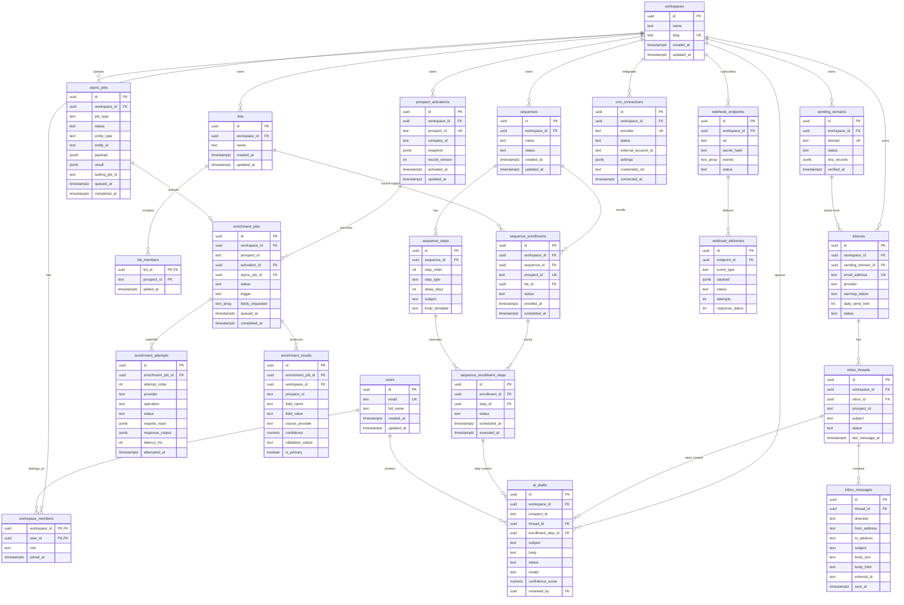

# Skout AI — Database Schema (MVP)

PostgreSQL OLTP schema for workspace-scoped, **activated** records only. The global prospect corpus (~200M) lives in **OpenSearch**; records are materialized here on activation, enrichment, or list/sequence use.

**Migrations:** Drizzle ORM in `packages/db` — table DDL is added per user story via `pnpm db:generate` / `pnpm db:migrate`. This document describes the target schema; it is not applied as raw SQL.

> **Canonical ER diagram + all design decisions:** [mvp/05-database-er-diagram.md](./mvp/05-database-er-diagram.md)  
> **Standalone Mermaid (full diagram):** [diagrams/skout-ai-complete-er.mmd](./diagrams/skout-ai-complete-er.mmd)

**Identity (ADR 0001):**

```
prospect_id  = SHA256(normalized_company_domain + ":" + SHA256(email))
company_id   = SHA256(normalized_company_domain)
```

`prospect_id` and `company_id` are stored as `TEXT` (64-char hex). They are not FKs to a local prospects table.

---

## ER Diagram



---

## Table Reference

### Tenancy & identity

| Table | Purpose | MVP API |
| --- | --- | --- |
| `workspaces` | Multi-tenant root | `GET /workspaces` |
| `users` | Platform users | (auth — header stub today) |
| `workspace_members` | User ↔ workspace RBAC | — |

### Prospects & lists

| Table | Purpose | MVP API |
| --- | --- | --- |
| `prospect_activations` | Workspace copy of activated prospect (`snapshot` JSONB) | `GET /prospects`, `POST /prospects/:id/enrich` |
| `lists` | Named prospect collections | `GET/POST /lists` |
| `list_members` | Prospect membership in a list | `POST /lists` (`prospectIds`) |

Search (`POST /search/prospects`) reads **OpenSearch**, not these tables.

### Lead enrichment (PAL waterfall)

| Table | Purpose | MVP API |
| --- | --- | --- |
| `enrichment_jobs` | One enrich request per prospect (links to activation + queue) | `POST /prospects/:id/enrich` → `202` |
| `enrichment_attempts` | Per-provider waterfall audit (`internal_graph` → `apollo` → `hunter` → …) | — |
| `enrichment_results` | Structured winning fields (email, company, validation) before snapshot merge | — |

After a job succeeds, the waterfall worker merges `enrichment_results` (where `is_primary = true`) into `prospect_activations.snapshot` and increments `record_version`.

### Async processing

| Table | Purpose | MVP API |
| --- | --- | --- |
| `async_jobs` | Generic BullMQ job state (enroll, send, CRM sync, AI) | `202` on enroll; enrich links via `enrichment_jobs.async_job_id` |

### Sequences

| Table | Purpose | MVP API |
| --- | --- | --- |
| `sequences` | Outreach sequence definition | `GET /sequences` |
| `sequence_steps` | Ordered steps (email, wait, manual) | — |
| `sequence_enrollments` | Prospect enrolled in a sequence | `POST /sequences/:id/enroll` |
| `sequence_enrollment_steps` | Per-step execution state | — |

### Email infrastructure

| Table | Purpose | MVP API |
| --- | --- | --- |
| `sending_domains` | Custom sending domains + DNS verification | `GET /domains` |
| `inboxes` | Sending/receiving mailboxes | `GET /inboxes` |
| `inbox_threads` | Conversation threads | `GET /inbox/threads` |
| `inbox_messages` | Individual messages in a thread | — |

### AI & integrations

| Table | Purpose | MVP API |
| --- | --- | --- |
| `ai_drafts` | Human-in-the-loop email drafts | `GET /ai/drafts` |
| `crm_connections` | CRM OAuth connections | `GET /crm/connections` |
| `webhook_endpoints` | Outbound webhook subscriptions | `GET /webhooks` |
| `webhook_deliveries` | Delivery log + retry state | — |

---

## Design conventions

| Convention | Rule |
| --- | --- |
| Primary keys | `UUID` via `gen_random_uuid()` |
| Timestamps | `TIMESTAMPTZ`, `created_at` / `updated_at` where mutable |
| Tenant isolation | `workspace_id` on all tenant tables |
| Prospect references | `TEXT prospect_id` (canonical hash, not a local FK) |
| Status fields | `TEXT` + `CHECK` constraint (enum-like) |
| Cascades | `ON DELETE CASCADE` for owned children; `SET NULL` for optional refs |
| Secrets | CRM tokens via `credentials_ref` → AWS Secrets Manager (not plain text) |
| RLS | Enable per-table after auth wiring (commented in `001`) |

---

## Data flow (MVP)

```
OpenSearch (corpus)
       │ search / activate
       ▼
prospect_activations ──► lists / list_members
       │
       ├──► enrichment_jobs ──► enrichment_attempts (PAL waterfall)
       │         │                      │
       │         └── async_jobs         └── apollo / hunter / prospeo / …
       │         │
       │         └──► enrichment_results ──► UPDATE snapshot
       │
       └──► sequence_enrollments ──► sequence_enrollment_steps
                    │
                    ├──► inboxes ──► inbox_threads ──► inbox_messages
                    │
                    └──► ai_drafts (HITL) ──► send worker
```


