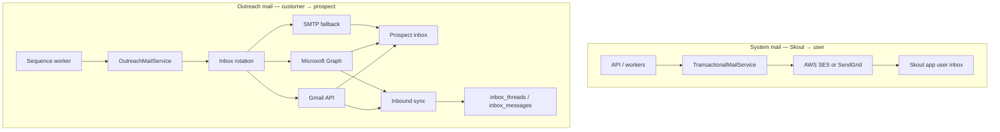

# Email sending architecture — implementation guide

**Audience:** backend/frontend engineers  
**Owner:** platform / outreach squad  
**Status:** design approved — implementation in progress  
**Last updated:** 2026-07-02

---

## 1. Goal

Skout uses **two completely separate email channels**. They must never share domains, credentials, or sending code paths.

| Channel | Purpose | Provider | Examples |
|--------|---------|----------|----------|
| **System mail** | Product / transactional email from Skout to Skout users | **AWS SES** (preferred) or SendGrid | workspace invite, passwordless link, billing receipt, export ready, admin alerts |
| **Outreach mail** | Cold sequences sent **on behalf of the customer** | **User-connected Gmail or Microsoft 365** | sequence step 1, follow-up, reply from unified inbox |

**Do not:**
- Send cold outreach through SES/SendGrid (ToS + deliverability risk).
- Send system mail through a user's connected Gmail/Microsoft inbox.
- Build custom SMTP servers or run your own mail IPs.

---

## 2. Architecture overview



---

## 3. What already exists (read this first)

Before writing new code, study these files:

| Area | Path | Notes |
|------|------|-------|
| Inbox schema | `packages/db/src/schema/inbox.ts` | `inboxes`, `sending_domains`, `inbox_threads`, `inbox_messages` |
| SMTP send (outreach) | `apps/api/src/services/email-sender.service.ts` | `buildEmailSenderFromInbox()` via nodemailer |
| Inbox CRUD | `apps/api/src/services/inbox.service.ts`, `apps/api/src/routes/inbox.routes.ts` | SMTP connect only today |
| Inbox rotation | `apps/api/src/services/inbox-rotation.service.ts` | Round-robin by `lastUsedAt` |
| Sequence send | `apps/api/src/workers/sequence-enrollment.worker.ts` | `executeEmailStep()` — suppression, tracking, send, thread write |
| OAuth reference | `apps/api/src/services/hubspot.client.ts`, `hubspot-credentials.store.ts`, `crm.routes.ts` | Copy this pattern for Google/Microsoft inbox OAuth |
| Ticket backlog | `docs/tickets/remaining-features-build-order.md` | R1.x sequences, R2.x inbox, R3.x deliverability |

**Already working for outreach (SMTP path):**
- Connect inbox with SMTP credentials (`POST /inboxes`)
- Sequence worker sends through rotated inbox
- Open/click tracking injection (`tracking.service.ts`)
- Suppression + unsubscribe URL
- Reply/bounce signal detection (reads `inbox_messages`)

**Not built yet:**
- System/transactional mail service (SES/SendGrid)
- Google / Microsoft OAuth inbox connect
- Inbound sync (IMAP / Gmail push / Graph webhooks)
- Daily send caps enforcement (schema has `dailySendLimit`, logic incomplete)
- Domain DNS verification UI (R3.3)

---

## 4. Channel A — System mail (SES or SendGrid)

### 4.1 Provider choice

| | **AWS SES** (recommended) | **SendGrid** |
|--|---------------------------|--------------|
| Fit | Already on AWS (ECS, Secrets Manager) | Good if team prefers SendGrid dashboard |
| Cost | Very low at volume | Free tier, then paid |
| Setup | Verify domain `mail.skout.ai`, DKIM in Route53 | Verify domain in SendGrid, add DNS records |
| SDK | `@aws-sdk/client-sesv2` | `@sendgrid/mail` |

**Decision for v1:** use **AWS SES**. Keep the interface provider-agnostic so SendGrid can be swapped later.

### 4.2 New module layout

```
apps/api/src/
  services/
    transactional-mail.service.ts      # public API for system mail
    transactional-mail/
      types.ts                         # TransactionalMailInput, MailTemplateId
      ses-transport.ts                 # SesTransport implements MailTransport
      sendgrid-transport.ts            # optional later
  templates/
    system/                            # HTML + text templates
      workspace-invite.hbs
      export-ready.hbs
      billing-receipt.hbs
```

### 4.3 Interface (implement exactly)

```ts
// apps/api/src/services/transactional-mail/types.ts

export type SystemMailTemplate =
  | "workspace_invite"
  | "export_ready"
  | "billing_receipt"
  | "low_credits_warning";

export interface TransactionalMailInput {
  to: string;
  template: SystemMailTemplate;
  variables: Record<string, string>;
  /** Optional override; default from env SYSTEM_MAIL_FROM */
  replyTo?: string;
}

export interface MailTransport {
  send(input: {
    from: string;
    to: string;
    subject: string;
    text: string;
    html: string;
    replyTo?: string;
  }): Promise<{ messageId: string }>;
}

export interface TransactionalMailService {
  send(input: TransactionalMailInput): Promise<{ messageId: string }>;
}
```

```ts
// apps/api/src/services/transactional-mail.service.ts — sketch

export function createTransactionalMailService(config: Env): TransactionalMailService {
  const transport = config.SYSTEM_MAIL_PROVIDER === "sendgrid"
    ? createSendGridTransport(config)
    : createSesTransport(config);

  return {
    async send({ to, template, variables, replyTo }) {
      const { subject, text, html } = renderSystemTemplate(template, variables);
      return transport.send({
        from: config.SYSTEM_MAIL_FROM!,
        to,
        subject,
        text,
        html,
        replyTo,
      });
    },
  };
}
```

### 4.4 Environment variables

Add to `apps/api/src/config/env.ts`:

| Variable | Required | Example | Notes |
|----------|----------|---------|-------|
| `SYSTEM_MAIL_PROVIDER` | no | `ses` | `ses` \| `sendgrid` \| `log` (dev) |
| `SYSTEM_MAIL_FROM` | yes (prod) | `Skout <noreply@mail.skout.ai>` | Must match verified SES domain |
| `SYSTEM_MAIL_REPLY_TO` | no | `support@skout.ai` | |
| `AWS_REGION` | yes for SES | `us-east-1` | ECS task role grants `ses:SendEmail` |
| `SENDGRID_API_KEY` | if sendgrid | — | Secrets Manager in prod |

**Dev / local:** set `SYSTEM_MAIL_PROVIDER=log` to print emails to stdout instead of sending.

### 4.5 AWS / CDK tasks

1. Verify sending domain in SES (e.g. `mail.skout.ai`).
2. Add DKIM + SPF records in Route53 (or DNS provider).
3. Request production access in SES (sandbox only sends to verified addresses until approved).
4. Grant API ECS task role: `ses:SendEmail`, `ses:SendRawEmail`.
5. Optional: store `SENDGRID_API_KEY` in `SkoutDev/sendgrid` secret if using SendGrid.

### 4.6 System mail triggers (v1 scope)

| Event | Template | Trigger location |
|-------|----------|------------------|
| Workspace invite sent | `workspace_invite` | future `POST /workspaces/invites` (R8.3) |
| Export job completed | `export_ready` | export worker on success |
| Razorpay payment captured | `billing_receipt` | `billing.service.ts` webhook handler |
| Credits below threshold | `low_credits_warning` | optional cron / on deduct |

**Rule:** only call `TransactionalMailService` from backend workers/routes — never from the browser.

### 4.7 Acceptance criteria — system mail

- [ ] `SYSTEM_MAIL_PROVIDER=log` works locally without AWS credentials.
- [ ] SES sends a test email from staging to a verified address.
- [ ] `From` domain has SPF + DKIM passing (check with mail-tester.com).
- [ ] Failed sends are logged with `messageId` / error; no silent drops.
- [ ] No system mail code imports `email-sender.service.ts` or touches `inboxes` table.

---

## 5. Channel B — Outreach mail (Gmail + Microsoft)

### 5.1 Design principles

1. **Send as the user** — `From` must be the connected mailbox (`alice@acme.com`), not `@mail.skout.ai`.
2. **OAuth first** — Gmail API + Microsoft Graph are primary; SMTP is fallback for generic providers.
3. **One inbox = one mailbox** — stored per workspace in `inboxes` table.
4. **Rotate across inboxes** — already implemented in `inbox-rotation.service.ts`.
5. **Throttle** — respect `dailySendLimit` per inbox (default 50/day for cold outreach).
6. **Verified emails only** — sequence worker already skips prospects without email and checks suppression.

### 5.2 Provider matrix

| Provider | `inboxes.provider` | Send API | Inbound sync (phase 2) | Scopes |
|----------|------------------|----------|------------------------|--------|
| Google Workspace / Gmail | `google` | Gmail API `users.messages.send` | Gmail `history.list` or push notifications | `gmail.send`, `gmail.readonly` |
| Microsoft 365 / Outlook | `microsoft` | Graph `POST /me/sendMail` | Graph `GET /me/messages` delta | `Mail.Send`, `Mail.Read` |
| Generic SMTP | `smtp` | nodemailer (existing) | IMAP polling (phase 2) | n/a |

### 5.3 Schema changes

Add migration `packages/db/drizzle/000X_inbox_oauth.sql`:

```sql
ALTER TABLE inboxes
  ADD COLUMN IF NOT EXISTS oauth_credentials_ref text,
  ADD COLUMN IF NOT EXISTS oauth_expires_at timestamptz,
  ADD COLUMN IF NOT EXISTS imap_host text,
  ADD COLUMN IF NOT EXISTS imap_port integer,
  ADD COLUMN IF NOT EXISTS sends_today integer NOT NULL DEFAULT 0,
  ADD COLUMN IF NOT EXISTS sends_today_reset_at timestamptz;

-- provider values: 'smtp' | 'google' | 'microsoft'
```

Update Drizzle schema in `packages/db/src/schema/inbox.ts` to match.

**Token storage:** follow HubSpot pattern — per-inbox OAuth tokens in AWS Secrets Manager:

```
{CRM_SECRETS_PREFIX}/inbox/{workspaceId}/{inboxId}/google
{CRM_SECRETS_PREFIX}/inbox/{workspaceId}/{inboxId}/microsoft
```

Local dev: mirror `hubspot-credentials.store.ts` with `.inbox-secrets/` when `CRM_CREDENTIALS_LOCAL=true`.

Token JSON shape:

```json
{
  "accessToken": "...",
  "refreshToken": "...",
  "expiresAt": "2026-07-02T12:00:00.000Z",
  "emailAddress": "user@gmail.com",
  "provider": "google"
}
```

### 5.4 New module layout

```
apps/api/src/
  services/
    outreach-mail.service.ts           # facade used by sequence worker
    outreach-mail/
      types.ts
      gmail-transport.ts               # Google Gmail API
      microsoft-transport.ts           # Microsoft Graph
      smtp-transport.ts                # move from email-sender.service.ts
    inbox-oauth/
      google-inbox.client.ts
      microsoft-inbox.client.ts
      inbox-credentials.store.ts       # clone hubspot-credentials.store pattern
  routes/
    inbox.routes.ts                    # extend with OAuth routes
```

### 5.5 Refactor sequence worker (small change)

Today `executeEmailStep()` calls `buildEmailSenderFromInbox()` directly.

**Change to:**

```ts
import { buildOutreachMailTransport } from "../services/outreach-mail.service.js";

const transport = await buildOutreachMailTransport(config, db, inbox);
const sendResult = await transport.send({ from, fromName, to, subject, text, html });
```

`buildOutreachMailTransport()` switches on `inbox.provider`:

```ts
switch (inbox.provider) {
  case "google":    return createGmailTransport(config, inbox);
  case "microsoft": return createMicrosoftTransport(config, inbox);
  case "smtp":
  default:          return createSmtpTransport(config, inbox);
}
```

### 5.6 OAuth API routes

Mirror `crm.routes.ts` HubSpot flow.

| Method | Path | Auth | Description |
|--------|------|------|-------------|
| `GET` | `/inboxes/google/connect` | JWT | Returns `{ url }` for OAuth redirect |
| `GET` | `/inboxes/google/callback` | none | Exchanges code, creates `inboxes` row, redirects to frontend |
| `GET` | `/inboxes/microsoft/connect` | JWT | Same for Microsoft |
| `GET` | `/inboxes/microsoft/callback` | none | Same |
| `POST` | `/inboxes` | JWT | Existing SMTP connect (keep) |
| `POST` | `/inboxes/:id/test-send` | JWT | Send test email to current user |
| `DELETE` | `/inboxes/:id` | JWT | Disconnect + delete tokens |
| `GET` | `/inboxes` | JWT | List with `provider`, `status`, `sendsToday`, `dailySendLimit` |

**Callback redirect:** `{FRONTEND_URL}/settings/outreach/inboxes?connected=google`

**State parameter:** HMAC-signed JSON `{ workspaceId, userId, provider, nonce }` — same approach as HubSpot OAuth state in `crm.service.ts`.

### 5.7 Google OAuth setup

1. Create project in [Google Cloud Console](https://console.cloud.google.com/).
2. Enable **Gmail API**.
3. OAuth consent screen → External → add scopes `gmail.send`, `gmail.readonly`.
4. Create OAuth 2.0 Web client:
   - Redirect URI: `{API_PUBLIC_URL}/api/v1/inboxes/google/callback`
5. Store `GOOGLE_INBOX_CLIENT_ID` / `GOOGLE_INBOX_CLIENT_SECRET` in Secrets Manager.

**Send implementation (`gmail-transport.ts`):**

```ts
// POST https://gmail.googleapis.com/gmail/v1/users/me/messages/send
// Body: { raw: base64url(MIME message) }
```

Build MIME with `nodemailer/lib/mail-composer` or `mailcomposer` — set `Message-ID`, `List-Unsubscribe` header from `buildUnsubscribeUrl()`.

**Token refresh:** before each send, if `expiresAt < now + 5min`, refresh via `https://oauth2.googleapis.com/token`.

### 5.8 Microsoft OAuth setup

1. Register app in [Azure Portal](https://portal.azure.com/) → App registrations.
2. Redirect URI: `{API_PUBLIC_URL}/api/v1/inboxes/microsoft/callback`
3. API permissions (delegated): `Mail.Send`, `Mail.Read`, `offline_access`, `User.Read`.
4. Store `MICROSOFT_INBOX_CLIENT_ID` / `MICROSOFT_INBOX_CLIENT_SECRET` in Secrets Manager.

**Send implementation (`microsoft-transport.ts`):**

```ts
// POST https://graph.microsoft.com/v1.0/me/sendMail
{
  "message": {
    "subject": "...",
    "body": { "contentType": "HTML", "content": "..." },
    "toRecipients": [{ "emailAddress": { "address": "prospect@co.com" } }]
  },
  "saveToSentItems": true
}
```

### 5.9 Throttling (R3.2 — implement with OAuth)

In `pickNextInbox()` or a new `pickSendableInbox()`:

1. Reset `sends_today` when `sends_today_reset_at` < start of UTC day.
2. Exclude inboxes where `sends_today >= dailySendLimit`.
3. Exclude `status != 'active'`.
4. After successful send: increment `sends_today`, set `lastUsedAt`.

Auto-pause inbox when bounce rate > 5% in rolling 7 days (phase 2).

### 5.10 Inbound reply sync (R2.1 — phase 2)

Not required for first send, but design for it now:

| Provider | Mechanism | Maps to |
|----------|-----------|---------|
| Gmail | `users.history.list` poll or Cloud Pub/Sub push | `inbox_messages` direction=`inbound` |
| Microsoft | Graph delta query on `/me/mailFolders/inbox/messages` | same |
| SMTP | IMAP IDLE / poll | same |

Link inbound messages to threads via `In-Reply-To` / `References` headers matching outbound `externalId` (RFC 5322 `Message-ID`).

When inbound human reply detected → pause enrollment (already in `detectCadenceSignal()`).

### 5.11 Acceptance criteria — outreach mail

- [ ] User connects Gmail via OAuth; inbox appears in `GET /inboxes` with `provider: "google"`.
- [ ] User connects Microsoft via OAuth; same for `microsoft`.
- [ ] `POST /inboxes/:id/test-send` delivers to the connecting user's email.
- [ ] Active sequence email step sends through OAuth transport (not SMTP).
- [ ] `inbox_threads` + `inbox_messages` rows created with `externalId` = provider message id.
- [ ] Inbox with `sends_today >= dailySendLimit` is skipped by rotation.
- [ ] Expired OAuth token is refreshed automatically; refresh failure sets inbox `status = 'auth_expired'`.
- [ ] SMTP connect path still works (regression test).

---

## 6. Frontend work (hand off to FE dev)

| Screen | Route | Actions |
|--------|-------|---------|
| Inbox settings | `/settings/outreach/inboxes` | List inboxes, connect Google, connect Microsoft, connect SMTP, test send, disconnect |
| Domain health | `/settings/outreach/domains` | R3.3 — later |
| Sequences | existing sequence UI | Enroll only allowed when ≥1 active inbox |

**Connect button flow:**
1. `GET /inboxes/google/connect` → redirect to Google.
2. Google redirects to API callback → API redirects to frontend `?connected=google`.
3. Frontend refetches `GET /inboxes`.

---

## 7. Security checklist

- [ ] OAuth tokens encrypted at rest (Secrets Manager prod, encrypted file local).
- [ ] Never return `smtpPasswordEncrypted`, `oauth_credentials_ref`, or tokens in API responses.
- [ ] OAuth callbacks validate HMAC `state` — reject tampered workspaceId.
- [ ] System mail and outreach mail use separate env vars and transports.
- [ ] Rate-limit `POST /inboxes/:id/test-send` (e.g. 5/hour per workspace).
- [ ] Log sends with `workspaceId`, `inboxId`, `enrollmentId` — never log full email bodies in prod.

---

## 8. Implementation phases (suggested order)

### Phase 1 — System mail (3–5 days)
1. Add env vars + `TransactionalMailService` with `log` and `ses` transports.
2. SES domain verification + ECS IAM.
3. Wire `export_ready` and `billing_receipt` as first templates.
4. Unit tests with mocked transport.

### Phase 2 — Google inbox OAuth (5–8 days)
1. Schema migration for OAuth fields.
2. `inbox-credentials.store.ts` + Google client.
3. Connect/callback routes + `gmail-transport.ts`.
4. Refactor sequence worker to `buildOutreachMailTransport()`.
5. `test-send` endpoint + tests.

### Phase 3 — Microsoft inbox OAuth (3–5 days)
1. Azure app + Graph transport.
2. Callback routes.
3. Cross-provider rotation test (Google + Microsoft in same workspace).

### Phase 4 — Throttling + inbound (5–8 days)
1. `sends_today` enforcement.
2. Gmail/Microsoft inbound poll worker.
3. Reply → pause sequence (extend R2.1).

---

## 9. Testing guide

### Local dev

```bash
# System mail — log to stdout
SYSTEM_MAIL_PROVIDER=log
SYSTEM_MAIL_FROM="Skout Dev <dev@localhost>"

# Outreach — SMTP (existing)
# Connect via POST /inboxes with Gmail app password or Mailhog SMTP

# Outreach — Google OAuth
# Use ngrok or deploy to dev API_PUBLIC_URL for callback
GOOGLE_INBOX_CLIENT_ID=...
GOOGLE_INBOX_CLIENT_SECRET=...
```

### Integration tests

| Test | File |
|------|------|
| SMTP send | `email-sender.service.test.ts` (exists) |
| Sequence email step | `sequence-enrollment.worker.test.ts` (exists) |
| Transactional mail | `transactional-mail.service.test.ts` (add) |
| Gmail transport | `gmail-transport.test.ts` (add, mock `fetch`) |
| OAuth callback | `inbox.routes.test.ts` (extend) |

### Manual QA script

1. Connect Gmail inbox → test send → verify email in Sent folder.
2. Create 2-step sequence → enroll test prospect → confirm send from connected address.
3. Reply to sequence email → confirm enrollment pauses (after R2.1).
4. Trigger export → confirm system email from `noreply@mail.skout.ai` (not user inbox).

---

## 10. Related tickets

| Ticket | Title |
|--------|-------|
| R1.3 | Email send + tracking |
| R2.1 | Inbound email ingestion |
| R3.1 | Sending inbox connect (OAuth + SMTP) |
| R3.2 | Inbox rotation + throttling |
| R3.3 | Domain warmup + DNS monitoring |
| R8.3 | Workspace invites (uses system mail) |

---

## 11. FAQ

**Q: Can we use SendGrid for sequences?**  
No. SendGrid/SES are for opted-in / transactional mail. Cold outreach must send from the customer's mailbox.

**Q: Can one inbox be used for system mail?**  
No. Keep channels fully separate.

**Q: What daily limit should we default to?**  
50 emails/inbox/day for cold outreach. Google Workspace may allow more, but start conservative (R3.3 warmup).

**Q: What if OAuth token expires?**  
Mark inbox `auth_expired`, surface banner in UI, prompt user to reconnect. Sequence steps fail with `failureReason: 'inbox_auth_expired'` until fixed.

**Q: HubSpot OAuth is already implemented — can I copy it?**  
Yes. Use the same state signing, callback redirect, and Secrets Manager storage patterns from `hubspot-credentials.store.ts` and `crm.routes.ts`.
