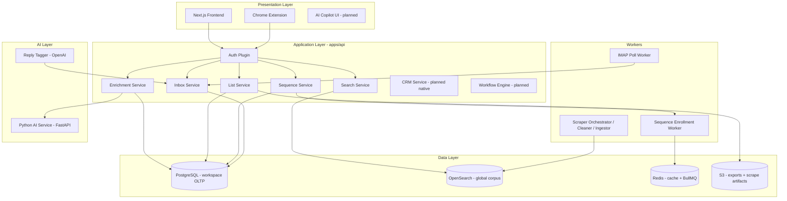

# Skout AI — Master PRD Implementation Guide

> Maps the [Master PRD summary](./master-prd-summary.md) to **phased engineering delivery** and the **current Skout AI codebase** (backend + frontend).  
> Use this for architecture planning, sprint prioritization, and gap analysis.

**Last updated:** 2026-07-08

---

## 1. Implementation north star

Build Skout as a **modular RevenueOS** on three foundations already in production:

1. **Unified Data Layer** — PostgreSQL workspace records + global OpenSearch corpus ([feature guide §2](./skout-ai-feature-guide.md))  
2. **Intelligence layer** — PAL enrichment, AI scoring (FastAPI), smart lists  
3. **Event + queue layer** — Redis/BullMQ workers (enrollment, IMAP poll, scrapers)

**Architectural rule (from PRD §6, §24):** CRM tables and APIs are canonical for customer context. Prospecting reads the corpus; activation copies into workspace; outreach and CRM reference the **same** `prospect_id` / workspace entities — never forked “prospect CRM” vs “sequence prospect” silos.

---

## 2. Current state vs PRD (honest snapshot)

| PRD workspace / capability | Status | Where it lives today |
|----------------------------|--------|----------------------|
| Auth + multi-tenant workspace | ✅ Shipped | Clerk, `workspaces`, `workspace_members`, stub auth in tests |
| Prospecting: search | ✅ Shipped | OpenSearch + `POST /search/prospects`, demo corpus fallback |
| Prospecting: ICP + scoring | ✅ Shipped | `workspace_icp`, AI `/enrichment/score`, `prospect_scores` |
| Prospecting: enrichment (waterfall) | ✅ Shipped | `packages/pal`, `enrichment_jobs`, provider adapters |
| Prospecting: lists + smart lists | ✅ Shipped | `lists`, smart list runner, CSV export |
| CRM: contacts/companies/deals | 🟡 Partial | HubSpot push; full native CRM entities **not** yet first-class |
| Outreach: sequences | 🟡 Partial | Schema + enroll API + worker; sending/tracking maturing (R1) |
| Outreach: inboxes + replies | 🟡 Partial | IMAP ingest, thread state machine, unified inbox UI (R2) |
| Outreach: deliverability | 🟡 Partial | Sending domains, inbox rotation, warmup fields |
| AI copilot (NL platform control) | 🔴 Planned | Scoring/research exist; no unified copilot orchestration |
| Revenue Intelligence / forecasting | 🔴 Planned | Dashboard basics; no deal-level forecast engine |
| Customer Success module | 🔴 Planned | — |
| Marketing module | 🔴 Planned | — |
| Workflow automation builder | 🔴 Planned | Event hooks partial; no visual builder |
| Integration marketplace | 🟡 Partial | HubSpot OAuth; Gmail/calendar/SFDC on roadmap |
| APE (autonomous prospecting) | 🟡 Partial | Smart lists + signals path; not fully autonomous |
| Chrome extension (capture) | ✅ Shipped | `apps/chrome-extension` |

Legend: ✅ production-capable · 🟡 in progress / partial · 🔴 not started

---

## 3. Target platform architecture (implementation view)



### Service boundaries (align with PRD §6)

| Service | Owns | Does not own |
|---------|------|----------------|
| **Search** | Corpus queries, filters, demo fallback | Workspace mutations |
| **Enrichment** | Jobs, PAL waterfall, credits, activations | Deal pipeline logic |
| **List** | Lists, members, export | Sequence scheduling |
| **Sequence** | Cadence definition, enrollment, step state | SMTP transport (delegates to email-sender + inbox) |
| **Inbox** | Threads, messages, reply classification | CRM deal stages (emits events → future CRM) |
| **CRM (future)** | Contacts, companies, deals, pipelines, activities | Duplicate prospect index |

---

## 4. Unified data model — implementation mapping

### 4.1 Canonical identity (already decided)

See [ADR 0001](./adr/0001-canonical-prospect-id.md):

- `prospect_id = SHA256(domain + ":" + SHA256(email))`  
- `company_id` derived from domain  
- OpenSearch document ID aligns with `prospect_id`

**PRD alignment:** “One Contact / One Company” — use `prospect_id` as the global key; workspace `prospect_activations.snapshot` is the tenant-owned copy.

### 4.2 PRD entity → current / planned tables

| PRD entity | Current implementation | Gap |
|------------|------------------------|-----|
| Organization | `workspaces` | Rename in UX to “Organization”; multi-workspace per org later |
| Contact | `prospect_activations` + snapshot JSON | Native `contacts` table for CRM workspace |
| Company | snapshot + OpenSearch company fields | Native `companies` table |
| Deal | — | `deals`, `pipelines`, `pipeline_stages` (new) |
| Activity | partial via `enrichment_jobs`, messages | Unified `activities` timeline |
| Sequence | `sequences`, `sequence_steps`, enrollments | ✅ |
| Signal | scraper manifests, future `signals` | Formalize signal store for APE |
| AI Insight | `prospect_scores`, `ai_drafts` | Generalize `ai_insights` |
| Workflow | — | `workflows`, `workflow_runs` |

### 4.3 Event catalog (implement incrementally)

Emit internal events (Redis stream or Postgres outbox) for PRD §6 workflows:

| Event | Producer (now / planned) | Consumers |
|-------|--------------------------|-----------|
| `prospect.activated` | Enrichment activation | Lists, analytics |
| `prospect.scored` | Score API | Smart lists, UI badges |
| `sequence.enrolled` | Sequence routes | Worker |
| `sequence.step_executed` | Enrollment worker | Tracking, analytics |
| `email.replied` | Inbound reply service | Pause enrollment, inbox UI |
| `email.bounced` | Inbound reply service | Suppression, rotation |
| `deal.created` | CRM (planned) | Forecast, notifications |
| `deal.stage_changed` | CRM (planned) | Workflow engine |

**Phase 1 implementation:** continue with direct service calls; introduce outbox when workflow builder lands (V1).

---

## 5. Phased implementation plan

### Phase 0 — Foundation (DONE)

**PRD mapping:** MVP prerequisites, unified data layer seed.

| Deliverable | Evidence |
|-------------|----------|
| Monorepo, CI/CD, dev/prod deploy | `infra/`, `.github/workflows/` |
| Auth + workspace provisioning | Clerk, `auth.service.ts` |
| OpenSearch search + activation | `search.service.ts`, enrichment routes |
| Credits + billing hooks | `credit_balances`, Razorpay |
| HubSpot export | CRM integration routes |
| Feature guide + MVP flows docs | `docs/skout-ai-feature-guide.md` |

---

### Phase 1 — Outreach loop (IN PROGRESS)

**PRD mapping:** Outreach workspace, partial CRM orchestration, PRD §24 workflow steps 3–6.

**Epics:** [R1](./tickets/remaining-features-build-order.md), [R2](./tickets/remaining-features-build-order.md), [R3](./tickets/remaining-features-build-order.md)

| # | Work item | PRD section | Acceptance |
|---|-----------|-------------|------------|
| 1.1 | Sequence CRUD + step builder | Outreach / Sequences | ✅ API + tests |
| 1.2 | Enrollment scheduler + worker | Outreach / Automation | ✅ Redis worker; CI guard when Redis absent |
| 1.3 | Email send + tracking | Outreach / Email | Open/click/reply hooks |
| 1.4 | Sending domains + inboxes | Deliverability | SMTP + rotation |
| 1.5 | Inbound IMAP + thread model | Unified inbox | ✅ R2.1 |
| 1.6 | Conversation state machine | Unified inbox | ✅ R2.2 + migration repair |
| 1.7 | Unified inbox UI | UI/UX | Frontend R2.3 |
| 1.8 | Reply → pause enrollment | CRM orchestration | Human reply pauses sequence |

**Exit criteria (Phase 1):** SDR can search → list → enroll → send → receive reply in inbox → sequence pauses — **without leaving Skout**.

---

### Phase 2 — Native Revenue Workspace (CRM operating layer)

**PRD mapping:** CRM workspace, §25 Unified Customer View, Deal Management (§28).

| # | Work item | Notes |
|---|-----------|-------|
| 2.1 | `companies`, `contacts`, `deals`, `pipelines`, `stages` schema | Drizzle migrations; link to `prospect_id` |
| 2.2 | Deal CRUD + Kanban API | Stage transitions emit events |
| 2.3 | Activity timeline service | Unify emails, calls, meetings, notes, enrichment |
| 2.4 | Auto-create deal on qualified reply | PRD automation example |
| 2.5 | Company 360 UI | PRD §25 single workspace view |
| 2.6 | HubSpot bi-directional sync (optional) | Migration path for existing CRM users |

**Design constraint:** Deals reference `company_id` / `prospect_id`; sequences and inbox threads link via `enrollment_id` (already on `inbox_threads`).

---

### Phase 3 — APE + Prospecting depth

**PRD mapping:** §10 Autonomous Prospecting Engine.

| # | Work item | Notes |
|---|-----------|-------|
| 3.1 | Saved searches + dynamic lists | Extend smart lists with signal filters |
| 3.2 | Signal store + detector jobs | Funding, hiring, tech from scrapers |
| 3.3 | Waterfall enrichment UI + job status | Expose `enrichment_jobs` in prospecting UI |
| 3.4 | AI research summaries per account | Store in `ai_insights` / activation snapshot |
| 3.5 | Prospect scoring framework | Fit + intent + engagement + readiness |
| 3.6 | Auto-activation rules | Score threshold → enroll / create deal / assign owner |

**Reuse:** PAL, scraper platform (`workers/scrapers`), OpenSearch, smart list runner.

---

### Phase 4 — AI Copilot + Revenue Intelligence (V1)

**PRD mapping:** AI Copilot workspace, §14 AI Models, Revenue Intelligence.

| # | Work item | Notes |
|---|-----------|-------|
| 4.1 | Copilot orchestration API | `POST /ai/copilot/query` with tool routing |
| 4.2 | Tool registry | search, create_list, enroll_sequence, summarize_thread, get_pipeline |
| 4.3 | RAG over workspace data | pgvector or OpenSearch kNN on activations + activities |
| 4.4 | Deal coach + risk scores | Uses deals + activity signals |
| 4.5 | Forecasting v1 | Stage-weighted pipeline + AI slippage flags |
| 4.6 | Meeting intelligence | Calendar integration + transcript ingestion |

---

### Phase 5 — Automation, CS, Marketing, Enterprise (V2)

**PRD mapping:** Workflow Automation, Customer Success, Marketing, Enterprise security.

| Track | Deliverables |
|-------|----------------|
| **Automation** | Visual workflow builder, webhook registry, integration sync engine |
| **Customer Success** | Health scores, renewals, expansion plays on same company record |
| **Marketing** | Forms, attribution, lead routing into activations |
| **Enterprise** | SSO/SCIM, field-level permissions, audit export, data residency |

---

## 6. API implementation checklist (PRD §11)

### Implemented today (representative)

```
POST /api/v1/search/prospects
GET  /api/v1/search/prospects/:id
POST /api/v1/enrichment/*
GET  /api/v1/lists, POST /api/v1/lists
POST /api/v1/smart-lists
GET  /api/v1/sequences, POST /api/v1/sequences/:id/enroll
GET  /api/v1/inboxes, GET /api/v1/inbox/threads
GET  /api/v1/credits/balance
```

### Next APIs (Phase 2–3)

```
# CRM
GET/POST/PATCH /api/v1/companies
GET/POST/PATCH /api/v1/contacts
GET/POST/PATCH /api/v1/deals
PATCH          /api/v1/deals/:id/stage
GET            /api/v1/activities?entityType=&entityId=

# APE
GET  /api/v1/prospects/search
POST /api/v1/prospects/enrich
POST /api/v1/prospects/research
GET  /api/v1/signals

# AI
POST /api/v1/ai/copilot/query
POST /api/v1/ai/summarize
POST /api/v1/ai/score
```

**Standards:** Keep `api/v1` prefix, workspace scoping via auth plugin, consistent error envelope (`apiError`), OpenAPI generation from route schemas (stretch).

---

## 7. Frontend workspace navigation (PRD §26)

Target IA (maps to Next.js app router groups):

| Nav item | Route group | Phase |
|----------|-------------|-------|
| Home | `/` | ✅ |
| Prospecting | `/search`, `/lists`, `/smart-lists` | ✅ |
| Outreach | `/sequences`, `/inbox`, `/settings/sending` | 🟡 |
| CRM | `/companies`, `/deals`, `/contacts` | Phase 2 |
| Revenue Intelligence | `/forecast`, `/insights` | Phase 4 |
| Automation | `/workflows` | Phase 5 |
| Settings | `/settings/*` | ✅ partial |

---

## 8. Infrastructure & delivery (PRD §16–17)

| Concern | Current approach | PRD target |
|---------|------------------|------------|
| Compute | ECS Fargate (API, AI, web, scrapers) | ✅ |
| Database | RDS PostgreSQL + migrations via ECS task | ✅ |
| Search | OpenSearch domain | ✅ |
| Queues | Redis + BullMQ | ✅; evaluate Temporal for sequences at scale |
| IaC | AWS CDK (`infra/`) | ✅ |
| CI | GitHub Actions: test, deploy-dev, E2E (frontend) | ✅ |
| Observability | Structured logging (`@skout/observability`) | Add metrics/tracing per PRD §16 |

**Migration discipline:** Journal `when` timestamps must monotonically increase (see repair migration `0012`); use idempotent `ADD COLUMN IF NOT EXISTS` for production drift recovery.

---

## 9. Testing strategy alignment (PRD §18)

| PRD test type | Repo practice |
|---------------|---------------|
| Unit | Vitest in `apps/api`, packages |
| Integration | Route tests with Docker Postgres (`ensure-test-postgres.mjs`) |
| E2E | Playwright in frontend repo, stubs API auth |
| AI evaluation | Manual + future golden sets for score/research |
| Security | RBAC tests per route; secrets via env/CDK |

**Add for CRM phase:** deal stage transition E2E, activity timeline integrity tests.

---

## 10. Team execution guidelines

### 10.1 Feature doc template

When starting any PRD feature, create a ticket or `docs/features/<name>.md` with the PRD §27 checklist (purpose → acceptance criteria → APIs → permissions).

### 10.2 Suggested sequencing (next 90 days)

1. **Finish Phase 1** — inbox 500 fix (migrations), sequence send/tracking, inbox UI polish, E2E green  
2. **Start Phase 2 schema** — deals/pipelines behind feature flag; no UX until timeline API exists  
3. **APE signals** — wire scraper outputs to prospecting UI (quick win for “intelligent” positioning)  
4. **Defer** marketing module, visual workflow builder, and full copilot until outreach + CRM loop is closed  

### 10.3 Anti-patterns (from PRD philosophy)

- ❌ Separate prospect database for sequences  
- ❌ Export CSV to “sync” with internal CRM  
- ❌ AI features that don’t write back to unified records  
- ❌ New migration files with backdated journal `when` values  

---

## 11. Success criteria by phase

| Phase | User-visible outcome | Metric |
|-------|---------------------|--------|
| 1 | Reply in inbox pauses sequence | E2E pass; reply detection rate |
| 2 | Deal created from qualified reply | % replies → deals |
| 3 | Dynamic list refreshes on signals | List freshness SLA |
| 4 | Copilot enrolls list from NL prompt | Copilot task completion rate |
| 5 | Enterprise customer on SSO + audit | Security review pass |

---

## 12. References

- [master-prd-summary.md](./master-prd-summary.md) — executive PRD condensation  
- [skout-ai-feature-guide.md](./skout-ai-feature-guide.md) — shipped feature deep dive  
- [mvp-flows.md](./mvp-flows.md) — MVP data flows  
- [remaining-features-build-order.md](./tickets/remaining-features-build-order.md) — R1–R9 epics  
- [database-schema.md](./database-schema.md) — OLTP reference  
- [scraping-platform-architecture.md](./scraping-platform-architecture.md) — corpus ingestion  
- [data-enrichment-strategy.md](./data-enrichment-strategy.md) — PAL / waterfall  
