# Skout AI — MVP User & Data Flows

Per-feature **user flows** (what the [SDR](#glossary-abbreviations--terms) does) and **data flows** (how data moves through systems) for the 45-day [MVP](#glossary-abbreviations--terms).

> **Abbreviations:** see the [Glossary](#glossary-abbreviations--terms) below (PAL, ICP, JWT, OLTP, etc.).

**Competitive reference:** [Apollo.io](https://www.apollo.io), [Snov.io](https://snov.io), [Reply.io](https://reply.io) — AI-native outbound / sales engagement tools. Skout adopts their proven patterns (search → enrich → qualify → list → export) while keeping Phase 1 features (sequences, inbox) out of MVP scope.

**Related docs:** [database-schema.md](./database-schema.md) · [mvp/01-development-plan.md](./mvp/01-development-plan.md) · [mvp/04-ui-specification.md](./mvp/04-ui-specification.md)

---

## Glossary (abbreviations & terms)

All shorthand used in this document. Expand on first read here; later sections use the short form.

### Product & business

| Term | Full form / meaning |
| --- | --- |
| **MVP** | **Minimum Viable Product** — the 45-day beta release (search → enrich → score → list → export). |
| **Phase 1** | Post-MVP release: sequences, unified inbox, AI reply drafts (HITL), webhooks, sending domains. |
| **SDR** | **Sales Development Representative** — primary user persona (finds leads, enriches, exports to CRM). |
| **ICP** | **Ideal Customer Profile** — workspace rules for a good lead (titles, industries, size, geography). Stored in `workspace_icp`. |
| **CRM** | **Customer Relationship Management** system — HubSpot in MVP; Salesforce deferred. |
| **B2B** | **Business-to-Business** — selling to companies (common ICP keyword). |
| **SaaS** | **Software as a Service** — subscription software industry (example ICP filter). |
| **VP** | **Vice President** — example seniority / job title in search and ICP filters. |

### AI & enrichment

| Term | Full form / meaning |
| --- | --- |
| **AI** | **Artificial Intelligence** — LLM-based lead scoring in MVP; reply drafting in Phase 1. |
| **LLM** | **Large Language Model** — model behind `/v1/score` (score 0–100 + reasoning). Served by FastAPI + LiteLLM. |
| **PAL** | **Provider Abstraction Layer** — internal package (`packages/pal`) that calls enrichment vendors through one API (`fetchEmail`, `fetchCompany`, `validate`) instead of wiring each provider in app code. See [`packages/pal/README.md`](../packages/pal/README.md). |
| **PAL waterfall** | Ordered provider chain for enrichment: `internal_graph` → `apollo` → `hunter` → `prospeo` → `scraper`. Each step is one `enrichment_attempts` row; first successful result wins. |
| **HITL** | **Human-in-the-Loop** — AI drafts an email; a user approves before send (`ai_drafts` table, Phase 1). |

### Authentication & security

| Term | Full form / meaning |
| --- | --- |
| **SSO** | **Single Sign-On** — sign in with Google (or Microsoft) without a separate Skout password. |
| **OAuth** | **Open Authorization** — protocol for Google login and HubSpot “Connect” flows. |
| **JWT** | **JSON Web Token** — signed token from Clerk proving user identity; sent as `Authorization: Bearer …` on API calls. |
| **JWKS** | **JSON Web Key Set** — Clerk’s public keys; API uses them to verify JWT signatures. |
| **Bearer** | HTTP auth scheme: `Authorization: Bearer <jwt>`. |

### Architecture (master data-flow diagram)

| Label | Full name | Role |
| --- | --- | --- |
| **FE** | **Frontend** | Next.js app (port 3000) — search, lists, settings UI. |
| **API** | **Application Programming Interface** | Fastify REST server (`apps/api`, port 3001). |
| **AUTH** | **Authentication middleware** | Validates JWT, sets `userId` / `workspaceId`. |
| **CREDIT** | **Credit guard middleware** | Checks `credit_balances` before paid actions. |
| **PG** | **PostgreSQL** | OLTP database — workspaces, activations, lists, jobs. |
| **OS** | **OpenSearch** | Search index for the global prospect corpus (~200M records). |
| **CH** | **ClickHouse** | Analytics store for fast total counts (optional on search path). |
| **REDIS** | **Redis** | In-memory cache + BullMQ backing store. |
| **S3** | **Amazon Simple Storage Service** | Object storage for generated CSV export files. |
| **BQ** | **BullMQ** | Redis-based job queue — enrich, score, export, CRM sync workers. |
| **PAL** | **Provider Abstraction Layer** | Enrichment vendor adapters (see above). |
| **HS** | **HubSpot** | External CRM API for one-way contact push. |
| **CLERK** | **Clerk** | Third-party auth service (sign-in, sessions, JWT). |
| **OLTP** | **Online Transaction Processing** | Postgres pattern: live reads/writes for activated workspace records only (not the full 200M corpus). |
| **TTL** | **Time To Live** | Cache expiry — search results cached in Redis for 5 minutes. |
| **SSE** | **Server-Sent Events** | One-way real-time push from server to browser (deferred; MVP uses polling). |

### Data, identity & schema

| Term | Full form / meaning |
| --- | --- |
| **ADR** | **Architecture Decision Record** — design doc in `docs/adr/`. **ADR 0001** defines `prospect_id` / `company_id` hashing. |
| **SHA256** | **Secure Hash Algorithm 256-bit** — `prospect_id = SHA256(domain + ":" + SHA256(email))`. |
| **JSONB** | **JSON Binary** — PostgreSQL column type for flexible JSON (`workspace_icp.config`, `snapshot`, etc.). |
| **UUID** | **Universally Unique Identifier** — primary keys (`workspaces.id`, `lists.id`, …). |
| **PK** | **Primary Key** — unique row identifier (e.g. `list_members`: `list_id` + `prospect_id`). |
| **FK** | **Foreign Key** — column referencing another table’s PK. |
| **UK** | **Unique Key** — constraint enforcing uniqueness (e.g. one HubSpot connection per workspace). |
| **TIMESTAMPTZ** | **Timestamp with time zone** — Postgres date/time column type (`created_at`, `queued_at`, …). |

### HTTP status codes (API responses)

| Code | Meaning in Skout |
| --- | --- |
| **200** | OK — request succeeded with a body. |
| **201** | **Created** — new resource (list, manual lead). |
| **202** | **Accepted** — async job queued (enrich, export, bulk score); work continues in background. |
| **204** | **No Content** — success with empty body (e.g. remove from list). |
| **402** | **Payment Required** — reused for **insufficient credits** (beta convention). |
| **400** | **Bad Request** — validation error (e.g. `ICP_NOT_CONFIGURED` on score). |

### File formats & UI

| Term | Full form / meaning |
| --- | --- |
| **CSV** | **Comma-Separated Values** — spreadsheet export from list detail. |
| **UI** | **User Interface** — screens, modals, tables, drawers in the frontend. |
| **API** (endpoint tables) | REST routes under `/api/v1/…` documented per feature below. |

### Sequence-diagram actors

| Label | Meaning |
| --- | --- |
| **U** | End user (browser) |
| **C** | Clerk (auth provider) |
| **W** | Background worker (BullMQ consumer) |

### External products (reference, not abbreviations)

| Name | What it is |
| --- | --- |
| **Apollo.io** | Competitor — people search, enrich, lists (UX reference). |
| **Snov.io** | Competitor — prospecting, email finder, lists, CSV export. |
| **Reply.io** | Competitor — outbound engagement, AI scoring patterns. |
| **HubSpot** | CRM integration target for MVP export. |
| **Razorpay** | Payment gateway for MVP self-serve credit pack purchases (India + international cards). |
| **Fastify** | Node.js HTTP framework for `apps/api`. |
| **FastAPI** | Python framework for `apps/ai` (scoring / LLM). |
| **Next.js** | React framework for the frontend repo. |

---

## MVP Feature Index

| # | Feature | Priority | Primary route(s) | Reference pattern |
| --- | --- | --- | --- | --- |
| 1 | [User Authentication](#1-user-authentication) | Critical | `/sign-in` | Apollo SSO · Snov email+Google · Reply split login |
| 2 | [Prospect Search](#2-prospect-search) | Critical | `/prospects/search` | Apollo People Search · Snov Prospecting · Reply Lead Search |
| 3 | [ICP Builder](#3-icp-builder) | Critical | `/icp`, `/onboarding/icp` | Apollo Saved Search + persona · Snov ICP filters |
| 4 | [AI Lead Qualification](#4-ai-lead-qualification) | Critical | Search + list score column | Apollo Scores · Reply AI scoring |
| 5 | [Contact Enrichment](#5-contact-enrichment) | Critical | Search · manual entry · `/enrichment` | Apollo Enrich · Snov Email Finder · manual add |
| 6 | [List Builder](#6-list-builder) | Critical | `/lists`, `/lists/[id]` | Apollo Lists · Snov Lists · Reply contact lists |
| 6a | [↳ Remove from list](#remove-prospect-from-list) | Critical | `/lists/[id]` row ⋮ menu | Apollo list member remove |
| 6b | [↳ Rename & delete list](#rename-and-delete-list) | Critical | `/lists` index ⋮ menu | Snov list management |
| 11 | [Enrichment Queue](#11-enrichment-queue) | Optional | `/enrichment` | Snov Verifier queue · Apollo enrichment log |
| 12 | [Workspace Settings](#12-workspace-settings) | Critical | `/settings/workspace` | Apollo workspace · Snov account settings |
| 7 | [CSV Export](#7-csv-export) | Critical | List export menu | Snov CSV export · Apollo export |
| 8 | [HubSpot Export](#8-hubspot-export) | Important | `/settings/crm` | Apollo HubSpot sync · Snov CRM push |
| 9 | [Credit Usage Tracking](#9-credit-usage-tracking) | Critical | Top bar + `/settings/workspace` | Apollo credits · Snov credits |
| 10 | [Dashboard](#10-dashboard) | Critical | `/dashboard` | Apollo Home · Reply analytics lite |
| 13 | [User-Owned Enrichment Integrations](#13-user-owned-enrichment-integrations) | Important | `/settings/integrations` | Apollo API keys · Snov own SMTP/API · BYOK enrichment |
| 14 | [Chrome Extension](#14-chrome-extension) | Important | Chrome Web Store + LinkedIn | Apollo extension · Snov LI prospector · Reply sidebar |
| 15 | [Prospect Corpus Seed (5,300)](#15-prospect-corpus-seed-5300) | Critical | OpenSearch bulk import | Apollo data scale · Snov list size · search coverage |
| 16 | [Razorpay Billing](#16-razorpay-billing) | Critical | `/settings/workspace` · insufficient-credits modal | Apollo credit packs · Snov buy credits · self-serve top-up |

**Tracker:** [mvp-feature-tracker.xlsx](./mvp/mvp-feature-tracker.xlsx) — done vs remaining with tentative completion dates.

---

## End-to-End MVP Journey

### Master user flow

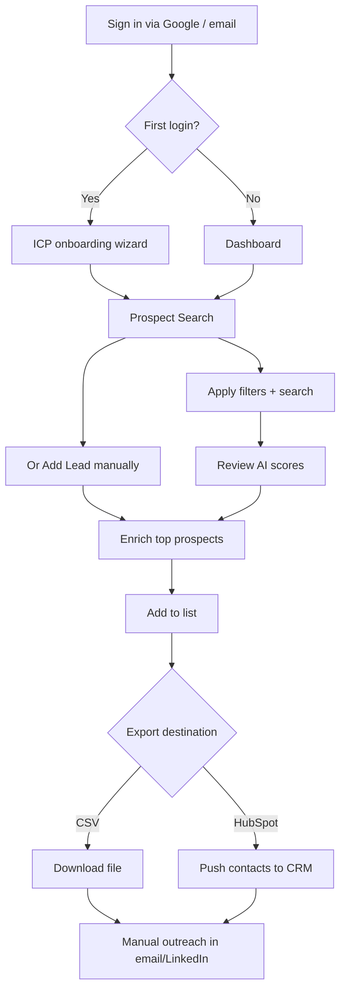

**Time to value:** first exported list in **< 15 minutes** (self-serve) or **< 30 minutes** (onboarding call).

### Master data flow

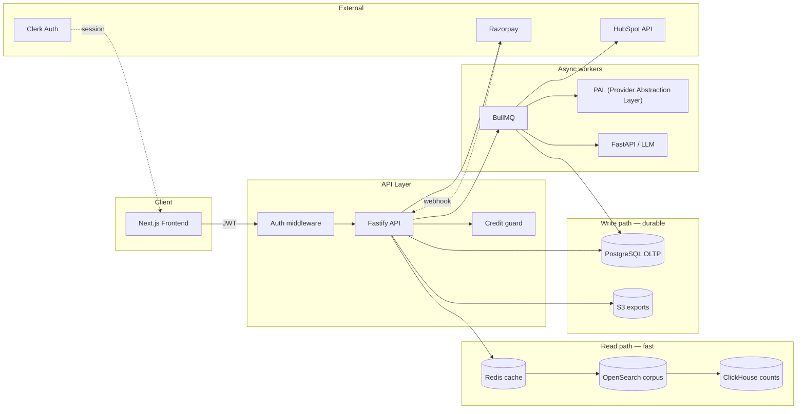

---

## 1. User Authentication

**Problem solved:** Secure, workspace-scoped access (replaces MVP stub `X-Workspace-Id` header).

**Competitive reference**

| Tool | Pattern | Skout adoption |
| --- | --- | --- |
| Apollo | Google + Microsoft SSO, workspace invite | Google SSO minimum; email magic link optional |
| Snov.io | Email/password + Google | Same; Clerk handles both |
| Reply.io | Split hero + SSO buttons | Split login layout (see UI spec) |

### User flow

```mermaid
flowchart TD
    U1[User visits app] --> U2{Authenticated?}
    U2 -->|No| U3[/sign-in page]
    U3 --> U4[Click Continue with Google]
    U4 --> U5[Clerk OAuth popup]
    U5 --> U6{New user?}
    U6 -->|Yes| U7[Provision user + workspace + 500 credits]
    U6 -->|No| U8[Load workspace membership]
    U7 --> U9{ICP configured?}
    U8 --> U9
    U9 -->|No| U10[/onboarding/icp]
    U9 -->|Yes| U11[/dashboard or /prospects/search]
    U2 -->|Yes| U11
```

| Step | Actor | Action | UI |
| --- | --- | --- | --- |
| 1 | User | Opens app URL | Landing or redirect to `/sign-in` |
| 2 | User | Authenticates via Google | Clerk OAuth |
| 3 | System | Creates `users` row + `workspace_members` (owner) + `credit_balances` if new | Background on first JWT |
| 4 | System | Issues session JWT | HttpOnly cookie / Clerk session |
| 5 | User | Completes ICP wizard (first run only) | 3-step onboarding |
| 6 | User | Lands in app shell | Sidebar + credit badge |

### Data flow

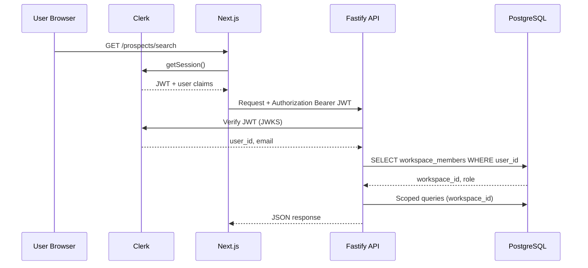

| Store | Tables / keys | Written when |
| --- | --- | --- |
| Clerk | `user_id`, email, OAuth tokens | Sign-up / sign-in |
| PostgreSQL | `users`, `workspace_members`, `workspaces`, `credit_balances` | First login provisioning |
| API context | `request.userId`, `request.workspaceId` | Every authenticated request |

**API:** Clerk middleware on all `/api/v1/*` except `/health`.

---

## 2. Prospect Search

**Problem solved:** Finding target accounts and contacts from a ~200M corpus without manual research.

**Competitive reference**

| Tool | Pattern | Skout adoption |
| --- | --- | --- |
| Apollo | Faceted People Search, saved searches (Phase 1) | Title, industry, geo, size, keywords filters |
| Snov.io | Prospecting database + filters | Same filter panel; credit per page |
| Reply.io | Lead database search | Results table with score column |

### User flow

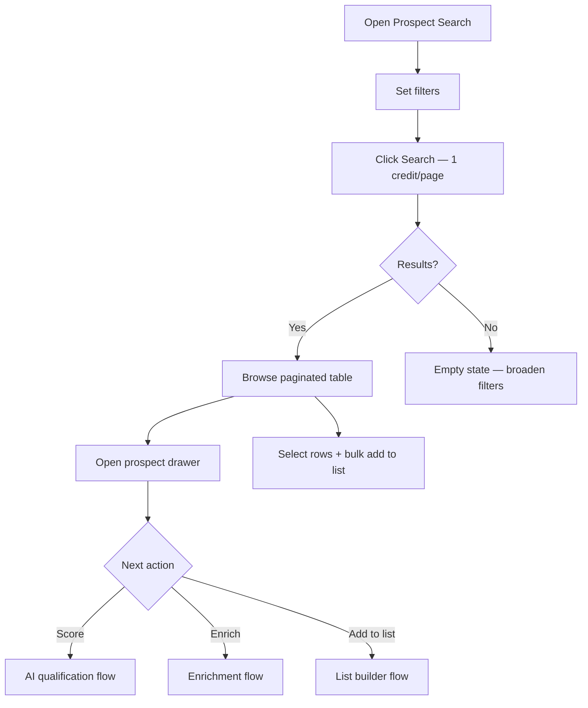

| Step | Actor | Action | Credits |
| --- | --- | --- | --- |
| 1 | User | Configures filters (title, industry, country, employee count, keywords) | — |
| 2 | User | Clicks Search | 1 per page (25 results) |
| 3 | System | Returns ranked prospects with optional cached score | — |
| 4 | User | Opens detail drawer, reviews company + contact fields | — |
| 5 | User | Enriches, scores, or adds to list | See feature flows |

### Data flow

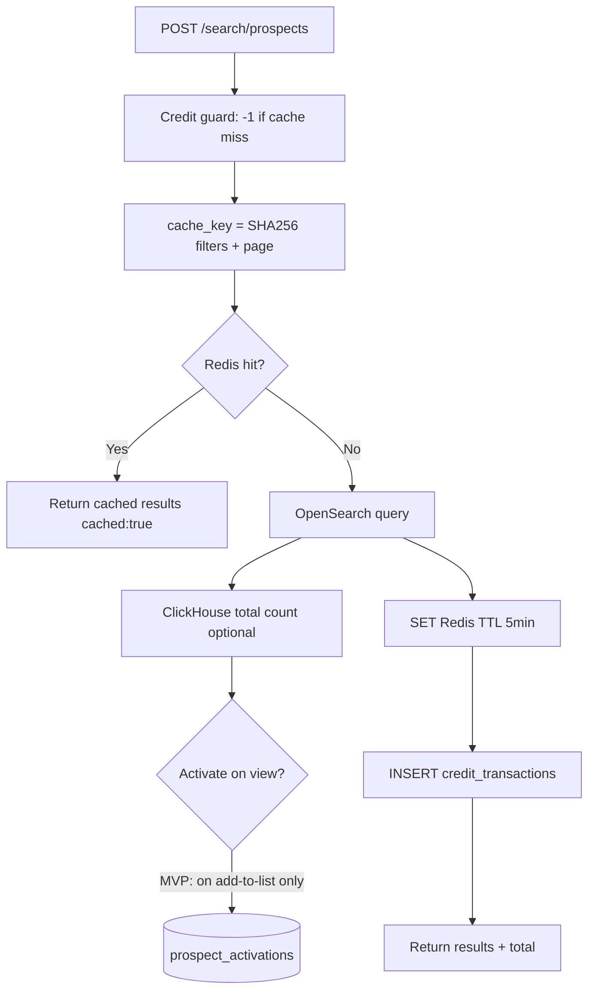

| Layer | Responsibility | MVP tables / indices |
| --- | --- | --- |
| OpenSearch | Full corpus search, filters, pagination | `prospects` index (~200M docs) |
| Redis | Cache search results by filter hash | `search:{workspace}:{hash}` |
| ClickHouse | Fast aggregate counts (optional) | `prospect_counts` |
| PostgreSQL | Activated copies only (not search source) | `prospect_activations` on list add |

**API:** `POST /api/v1/search/prospects` · `GET /api/v1/search/prospects/:id`

**Identity:** `prospect_id = SHA256(domain + ":" + SHA256(email))` per ADR 0001.

---

## 3. ICP Builder

**Problem solved:** Define who qualifies as a good lead so AI scoring has context.

**Competitive reference**

| Tool | Pattern | Skout adoption |
| --- | --- | --- |
| Apollo | Persona + search criteria | JSONB `workspace_icp.config` |
| Snov.io | Target audience filters | Chip-based multi-select UI |
| Reply.io | Ideal customer fields in campaign setup | 3-step onboarding wizard |

### User flow

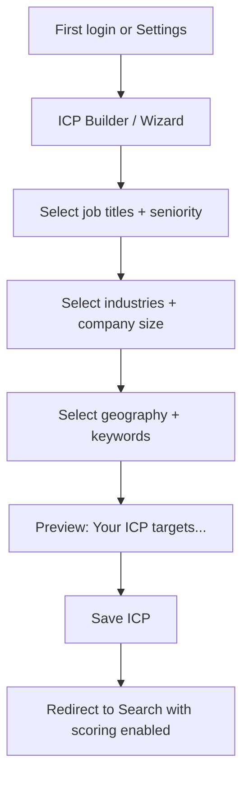

| Step | Actor | Action |
| --- | --- | --- |
| 1 | User | Defines titles, departments, seniority |
| 2 | User | Defines industries, employee ranges, countries |
| 3 | User | Optional keywords (B2B, enterprise, etc.) |
| 4 | System | Persists `workspace_icp` v1 JSONB |
| 5 | System | Enables Score actions in search + lists |

### Data flow

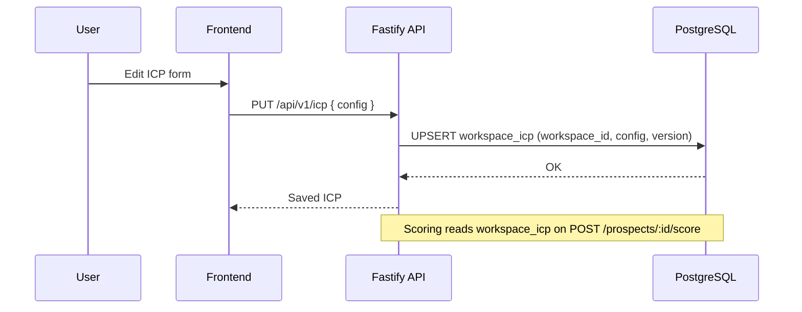

| Field (JSONB) | Example | Used by |
| --- | --- | --- |
| `titles[]` | VP Sales, Director Marketing | Search filters + LLM prompt |
| `industries[]` | Software, SaaS | Scoring |
| `employee_ranges[]` | 201-500 | Scoring |
| `countries[]` | US, DE | Search + scoring |
| `keywords[]` | B2B, outbound | Scoring reasoning |

**API:** `GET /api/v1/icp` · `PUT /api/v1/icp`

---

## 4. AI Lead Qualification

**Problem solved:** Too many unqualified prospects — prioritize who to enrich and export.

**Competitive reference**

| Tool | Pattern | Skout adoption |
| --- | --- | --- |
| Apollo | Engagement scores + filters | 0–100 ICP match + reasoning text |
| Reply.io | AI lead scoring in sequences | Standalone score before outreach |
| Snov.io | Lead status tags | High / Medium / Low priority badge |

### User flow

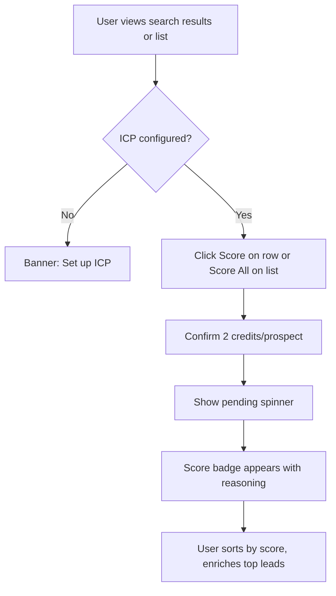

| Step | Actor | Action | Credits |
| --- | --- | --- | --- |
| 1 | User | Triggers score (single or bulk list job) | 2 / prospect |
| 2 | System | Loads prospect fields + `workspace_icp` | — |
| 3 | AI service | LLM returns score 0–100, reasoning, priority | — |
| 4 | System | Upserts `prospect_scores` | — |
| 5 | User | Sees color badge (High ≥75, Medium 50–74, Low <50) | — |

### Data flow

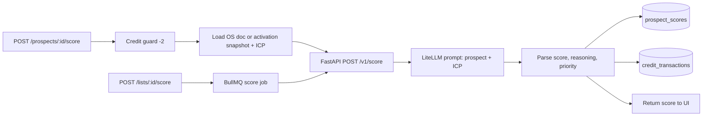

| Store | Table | Key fields |
| --- | --- | --- |
| PostgreSQL | `prospect_scores` | `workspace_id`, `prospect_id`, `score`, `reasoning`, `priority` |
| PostgreSQL | `workspace_icp` | Input to scoring prompt |
| PostgreSQL | `async_jobs` | Bulk list scoring (`job_type = ai_inference`) |

**API:** `POST /api/v1/prospects/:id/score` · `POST /api/v1/lists/:id/score` → `202`

---

## 5. Contact Enrichment

**Problem solved:** Missing verified emails and company data for outreach.

**Competitive reference**

| Tool | Pattern | Skout adoption |
| --- | --- | --- |
| Apollo | One-click enrich + manual contact add | PAL waterfall + manual lead form |
| Snov.io | Email finder + verifier + add prospect manually | `fetch_email` → `validate`; manual entry |
| Reply.io | Data enrichment + manual contact import | Manual enrich from search or typed lead |

### Entry paths

| Path | Trigger | When to use |
| --- | --- | --- |
| **A — Search** | Enrich on search result / drawer | Lead found in OpenSearch corpus |
| **B — Manual lead entry** | Add Lead form | Lead from event, referral, LinkedIn, spreadsheet — not in search |
| **C — Enrichment queue** | `/enrichment` page | Monitor all pending/running jobs (paths A + B) |

Both paths converge on the same **PAL** (**Provider Abstraction Layer**) waterfall worker and `enrichment_jobs` table. See [Glossary § PAL](#ai--enrichment).

### User flow — from search (Path A)

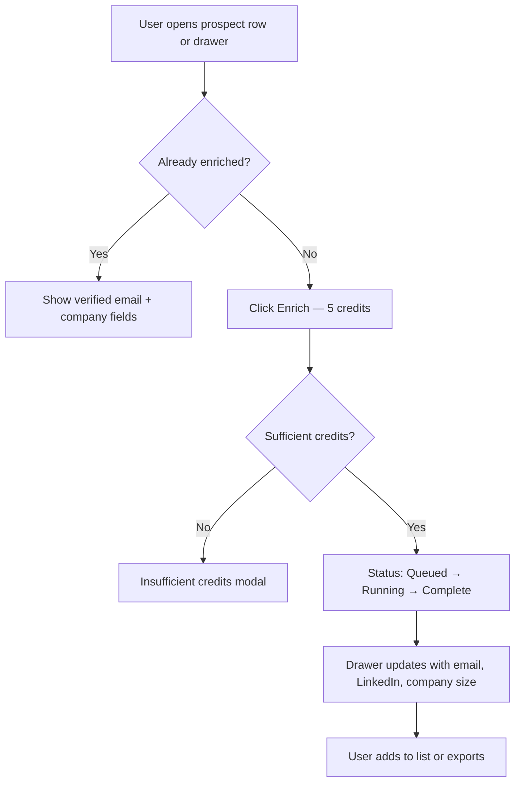

| Step | Actor | Action | Credits |
| --- | --- | --- | --- |
| 1 | User | Clicks Enrich on prospect | 5 |
| 2 | API | Returns `202` + `jobId` | — |
| 3 | Worker | Runs PAL waterfall | — |
| 4 | User | Sees enrichment status icon in UI / queue | — |
| 5 | System | Merges winning fields into activation snapshot | — |

### User flow — manual lead entry (Path B)

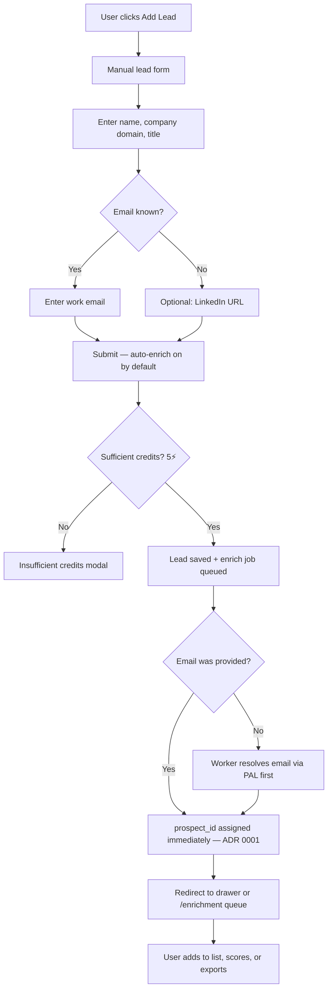

**Add Lead** entry points: Prospect Search toolbar · List detail `[ + Add Prospects ]` · `/enrichment` header.

| Field | Required | Notes |
| --- | --- | --- |
| Full name | Yes | Display + PAL input |
| Company domain | Yes | `company_id` + identity anchor |
| Title | No | Stored in snapshot |
| Work email | No* | *If provided, `prospect_id` computed at submit |
| LinkedIn URL | No | PAL input when email missing |

| Step | Actor | Action | Credits |
| --- | --- | --- | --- |
| 1 | User | Opens Add Lead modal or `/prospects/manual` | — |
| 2 | User | Fills form (minimum: name + domain) | — |
| 3 | User | Submits with auto-enrich enabled (default) | 5 |
| 4 | System | Creates `prospect_activations` + `enrichment_jobs` (`trigger=manual`) | — |
| 5 | Worker | If no email: waterfall finds email, then assigns `prospect_id` | — |
| 6 | User | Sees lead in activated prospects + enrichment queue | — |

### Data flow — search-triggered enrich (Path A)

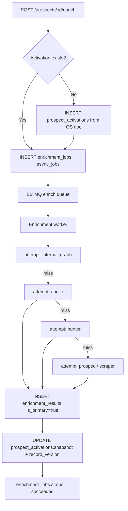

### Data flow — manual lead entry (Path B)

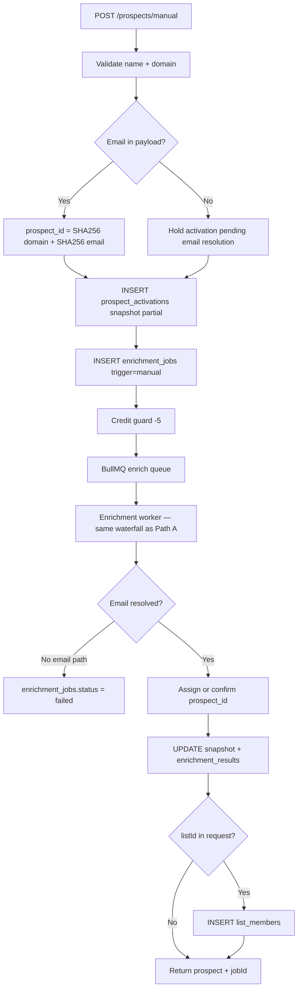

| Table | Role |
| --- | --- |
| `enrichment_jobs` | One row per enrich request; `trigger` = `manual` (search or typed lead) \| `bulk` |
| `enrichment_attempts` | Audit trail per PAL provider call |
| `enrichment_results` | Winning field values before snapshot merge |
| `prospect_activations` | Durable workspace copy (`snapshot` JSONB) |
| `async_jobs` | Generic BullMQ mirror (`job_type = enrich`) |
| `credit_transactions` | `-5` on job accept |
| `list_members` | Optional immediate add when `listId` passed on manual create |

**PAL (Provider Abstraction Layer) waterfall order:** `internal_graph` → `apollo` → `hunter` → `prospeo` → `scraper` — implemented in [`packages/pal`](../packages/pal/README.md).

**API:**

| Method | Path | Path |
| --- | --- | --- |
| `POST` | `/api/v1/prospects/:id/enrich` | A — search enrich → `202` |
| `POST` | `/api/v1/prospects/manual` | B — manual lead entry → `201` + optional enrich `202` |
| `GET` | `/api/v1/enrichment/jobs` | C — queue list (see §11) |

---

## 6. List Builder

**Problem solved:** Organizing prospects for export and manual outreach campaigns.

**Competitive reference**

| Tool | Pattern | Skout adoption |
| --- | --- | --- |
| Apollo | Lists + bulk actions | Named lists, bulk add from search |
| Snov.io | Prospect lists | Same; avg score column |
| Reply.io | Contact lists for campaigns | MVP: export-only (no sequence enroll) |

### User flow

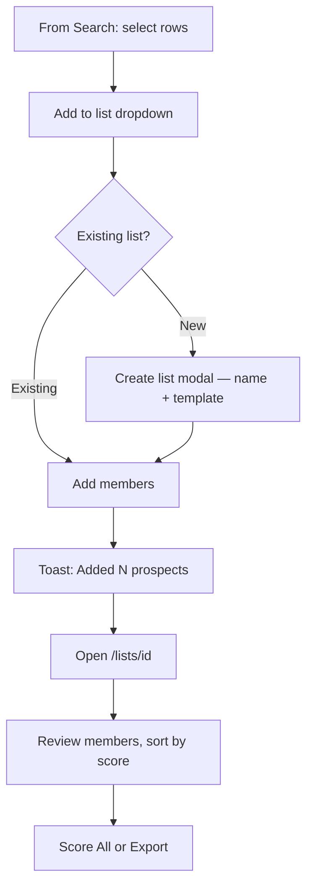

| Step | Actor | Action | Side effect |
| --- | --- | --- | --- |
| 1 | User | Selects prospects in search results | — |
| 2 | User | Adds to new or existing list | — |
| 3 | System | Upserts `prospect_activations` if not activated | Materialize from OpenSearch |
| 4 | System | Inserts `list_members` | — |
| 5 | User | Opens list detail, reviews avg score | — |

### Data flow — add prospects

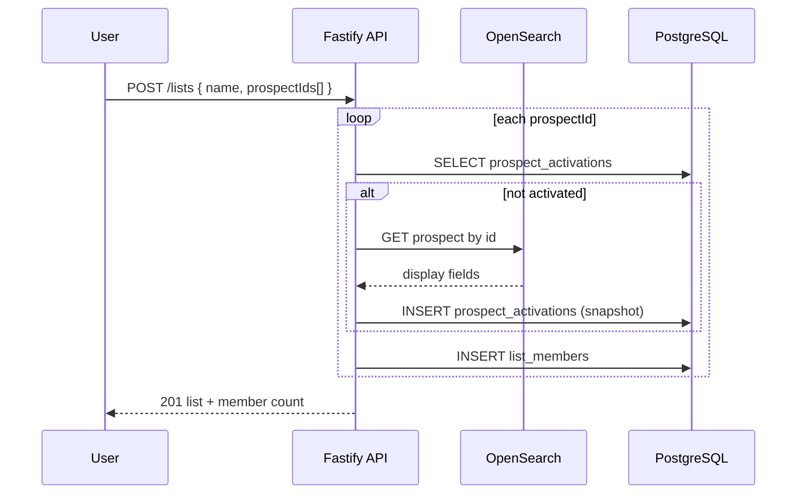

### Remove prospect from list

**Problem solved:** Keep lists accurate without deleting the underlying activated prospect.

**Competitive reference:** Apollo and Snov.io both allow removing contacts from a list without deleting them from the workspace database.

#### User flow

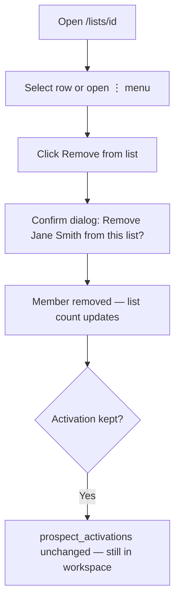

| Step | Actor | Action | Side effect |
| --- | --- | --- | --- |
| 1 | User | Removes one or bulk-selected members | — |
| 2 | System | Deletes `list_members` row(s) only | `prospect_activations` retained |
| 3 | UI | Recalculates avg score + member count | — |

Bulk remove: select checkboxes → **Remove selected** (same confirm pattern).

#### Data flow

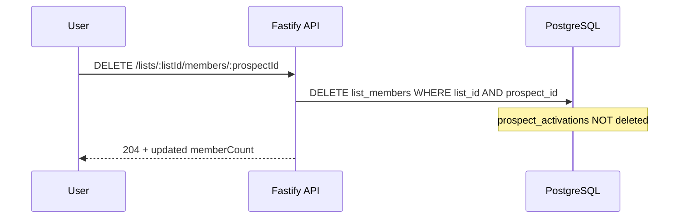

**API:** `DELETE /api/v1/lists/:id/members/:prospectId` · `POST /api/v1/lists/:id/members/remove` (bulk `{ prospectIds[] }`)

---

### Rename and delete list

**Problem solved:** Manage list lifecycle — rename campaigns, delete obsolete lists.

#### User flow — rename

```mermaid
flowchart TD
    N1[/lists index or list detail] --> N2[⋮ menu → Rename]
    N2 --> N3[Inline edit or modal with new name]
    N3 --> N4[Save]
    N4 --> N5[List title updates across app]
```

#### User flow — delete

```mermaid
flowchart TD
    D1[/lists index ⋮ menu] --> D2[Delete list]
    D2 --> D3[Confirm: Delete Q1 Enterprise Outbound?]
    D3 --> D4[Type list name to confirm destructive action]
    D4 --> D5[List removed from index]
    D5 --> D6[Members deleted — activations kept]
```

| Action | `lists` | `list_members` | `prospect_activations` |
| --- | --- | --- | --- |
| Rename | `name` updated | — | — |
| Delete | Row deleted (CASCADE) | All members deleted | **Not** deleted |

#### Data flow

```mermaid
flowchart LR
    PATCH[PATCH /lists/:id name] --> PG1[(UPDATE lists)]
    DELETE[DELETE /lists/:id] --> PG2[(DELETE lists CASCADE list_members)]
```

**API:** `PATCH /api/v1/lists/:id` · `DELETE /api/v1/lists/:id`

---

| Table | Purpose |
| --- | --- |
| `lists` | Named collection per workspace |
| `list_members` | `list_id` + `prospect_id` PK |
| `prospect_activations` | Created on first list add, enrich, or manual entry; survives list delete |

**API:** `GET /api/v1/lists` · `POST /api/v1/lists` · `PATCH /api/v1/lists/:id` · `DELETE /api/v1/lists/:id` · `GET /api/v1/prospects` (activated only)

---

## 7. CSV Export

**Problem solved:** Immediate data portability for SDRs using spreadsheets or other tools.

**Competitive reference**

| Tool | Pattern | Skout adoption |
| --- | --- | --- |
| Snov.io | Export list to CSV | Presigned S3 URL or direct download |
| Apollo | Export selected contacts | Flat fee 2 credits per list export |
| Reply.io | CSV import/export | Export-only in MVP |

### User flow

```mermaid
flowchart TD
    X1[Open list detail] --> X2[Export menu → Download CSV]
    X2 --> X3[Confirm 2 credits]
    X3 --> X4[Progress indicator]
    X4 --> X5[Browser downloads .csv]
    X5 --> X6[User imports to spreadsheet or dialer]
```

| Step | Actor | Action | Credits |
| --- | --- | --- | --- |
| 1 | User | Chooses CSV export on list | 2 flat per export |
| 2 | System | Builds CSV from activations + scores + enrichment | — |
| 3 | System | Uploads to S3, returns presigned URL | — |
| 4 | User | Downloads file | — |

### Data flow

```mermaid
flowchart LR
    REQ[GET /lists/:id/export/csv] --> CREDIT[Credit guard -2]
    CREDIT --> JOIN[JOIN list_members + prospect_activations + prospect_scores]
    JOIN --> CSV[Generate CSV columns]
    CSV --> S3[PUT S3 exports/workspace/list/timestamp.csv]
    S3 --> URL[Presigned GET URL 15min]
    URL --> TXN[credit_transactions + async_jobs optional]
    URL --> RESP[Return downloadUrl]
```

**CSV columns (MVP):** `full_name`, `title`, `email`, `company`, `domain`, `industry`, `employee_count`, `country`, `linkedin_url`, `icp_score`, `priority`

**API:** `GET /api/v1/lists/:id/export/csv`

---

## 8. HubSpot Export

**Problem solved:** Push qualified contacts into the SDR's existing CRM workflow.

**Competitive reference**

| Tool | Pattern | Skout adoption |
| --- | --- | --- |
| Apollo | HubSpot bi-directional sync (MVP: one-way push) | OAuth connect + contact create |
| Snov.io | CRM export | Per-contact credit |
| Reply.io | CRM integration | HubSpot only in MVP |

### User flow

```mermaid
flowchart TD
    H0{HubSpot connected?} -->|No| H1[Settings → Connect HubSpot]
    H1 --> H2[OAuth popup → grant access]
    H2 --> H3[crm_connections status = connected]
    H0 -->|Yes| H4[Open list → Export → Push to HubSpot]
    H3 --> H4
    H4 --> H5[Confirm 1 credit/contact]
    H5 --> H6[Progress: N of M contacts]
    H6 --> H7[Success toast + CRM link]
```

| Step | Actor | Action | Credits |
| --- | --- | --- | --- |
| 1 | User | Connects HubSpot via OAuth (one-time) | — |
| 2 | User | Pushes list to HubSpot | 1 / contact |
| 3 | Worker | Creates/updates HubSpot contacts | — |
| 4 | System | Stores `external_id` mapping (idempotent re-push) | — |

### Data flow

```mermaid
flowchart TD
    OAUTH[POST /crm/hubspot/connect] --> HS_TOKEN[Store tokens in Secrets Manager]
    HS_TOKEN --> CRM[(crm_connections)]

    PUSH[POST /lists/:id/export/hubspot] --> CREDIT[Credit guard -1 x N]
    CREDIT --> JOB[async_jobs job_type=crm_sync]
    JOB --> BQ[BullMQ CRM worker]
    BQ --> MAP[Map snapshot fields → HubSpot properties]
    MAP --> API_CALL[HubSpot Contacts API batch create]
    API_CALL --> LOG[Update job result + credit_transactions]
```

| Store | Purpose |
| --- | --- |
| `crm_connections` | `provider=hubspot`, `credentials_ref`, `external_account_id` |
| AWS Secrets Manager | OAuth access + refresh tokens (not plain text in PG) |
| `async_jobs` | Export job status + per-contact results |

**API:** `POST /api/v1/crm/hubspot/connect` · `POST /api/v1/lists/:id/export/hubspot` → `202` · `GET /api/v1/crm/connections`

---

## 9. Credit Usage Tracking

**Problem solved:** Monetization guardrails and transparency for beta customers.

**Competitive reference**

| Tool | Pattern | Skout adoption |
| --- | --- | --- |
| Apollo | Export credits, enrichment credits | Unified ⚡ credit wallet |
| Snov.io | Credit balance in header | Top bar badge + usage drawer |
| Reply.io | Plan limits | Self-serve credit packs via Razorpay |

### User flow

```mermaid
flowchart TD
    C1[User sees Credits: N in top bar] --> C2[Performs paid action]
    C2 --> C3{Balance sufficient?}
    C3 -->|No| C4[Insufficient credits modal]
    C4 --> C4a[Buy credits → Razorpay Checkout]
    C3 -->|Yes| C5[Action proceeds]
    C5 --> C6[Badge decrements]
    C6 --> C7[User opens usage history in Settings]
```

| Action | Credits | `credit_transactions.action` |
| --- | --- | --- |
| Search (per page) | 1 | `search` |
| Enrichment | 5 | `enrich` |
| AI Score | 2 | `score` |
| CSV export | 2 | `export_csv` |
| HubSpot (per contact) | 1 | `export_hubspot` |
| Razorpay credit pack | +N | `razorpay_topup` |
| Admin top-up (fallback) | +N | `admin_topup` |

### Data flow

```mermaid
flowchart LR
    ACTION[Any paid API call] --> MW[Credit middleware]
    MW --> BAL[SELECT credit_balances FOR UPDATE]
    BAL --> CHECK{balance >= cost?}
    CHECK -->|No| REJECT[402 Insufficient credits]
    CHECK -->|Yes| DEDUCT[UPDATE balance -= cost]
    DEDUCT --> TXN[INSERT credit_transactions append-only]
    TXN --> HANDLER[Route handler]
```

| Table | Rule |
| --- | --- |
| `credit_balances` | One row per workspace; `balance` updated atomically |
| `credit_transactions` | Append-only ledger; never delete |
| Beta default | 500 credits on workspace provision |

**API:** `GET /api/v1/credits/balance` · `GET /api/v1/credits/transactions`

> Workspace rename and profile settings are documented in [§12 Workspace Settings](#12-workspace-settings). Credit balance and usage history live on the same `/settings/workspace` page.

---

## 10. Dashboard

**Problem solved:** At-a-glance usage and quick navigation to core workflows.

**Competitive reference**

| Tool | Pattern | Skout adoption |
| --- | --- | --- |
| Apollo | Home with activity feed | Credits + weekly activity counts |
| Snov.io | Dashboard cards | 4 stat cards + quick actions |
| Reply.io | Campaign overview (lite) | Recent activity list only in MVP |

### User flow

```mermaid
flowchart TD
    D1[User lands on /dashboard] --> D2[View 4 stat cards]
    D2 --> D3[Scan recent activity feed]
    D3 --> D4{Quick action}
    D4 -->|Search| D5[/prospects/search]
    D4 -->|Lists| D6[/lists]
    D4 -->|ICP| D7[/icp]
```

| Card | Source |
| --- | --- |
| Credits left | `credit_balances.balance` |
| Searches this week | `credit_transactions` where `action=search` |
| Enriched this week | `enrichment_jobs` completed |
| Exports this week | `credit_transactions` export actions |

### Data flow

```mermaid
flowchart LR
    REQ[GET /dashboard/summary] --> PG[(PostgreSQL aggregates)]
    PG --> BAL[credit_balances]
    PG --> TXN[credit_transactions last 7d]
    PG --> ENR[enrichment_jobs completed]
    PG --> ACT[activity feed UNION queries]
    ACT --> RESP[JSON summary + recentActivity[]]
```

**API:** `GET /api/v1/dashboard/summary`

---

## 11. Enrichment Queue

**Problem solved:** Single place to monitor all enrichment jobs — from search, manual entry, or bulk — without checking each prospect individually.

**Competitive reference**

| Tool | Pattern | Skout adoption |
| --- | --- | --- |
| Snov.io | Verifier / enrichment task list with status | Filterable job table |
| Apollo | Enrichment activity in contact timeline | Workspace-wide queue view |
| Reply.io | Background task indicators | Status badges + retry |

**Route:** `/enrichment` (optional dedicated page; job status also inline on search rows and list detail)

### User flow

```mermaid
flowchart TD
    Q1[User opens /enrichment] --> Q2[View job table]
    Q2 --> Q3[Filter: All / Pending / Running / Complete / Failed]
    Q3 --> Q4[Click row → job detail drawer]
    Q4 --> Q5{Status}
    Q5 -->|pending/running| Q6[Show provider waterfall progress]
    Q5 -->|succeeded| Q7[Link to prospect drawer — enriched fields]
    Q5 -->|failed| Q8[Show error + Retry button — 5⚡]
    Q2 --> Q9[Add Lead → manual entry flow §5 Path B]
```

| Column | Source |
| --- | --- |
| Prospect | `snapshot.full_name` + domain |
| Trigger | `enrichment_jobs.trigger` — `manual` (search or typed lead), `bulk` |
| Status | `pending` → `running` → `succeeded` \| `failed` |
| Provider | Latest `enrichment_attempts.provider` |
| Started / Completed | `queued_at`, `completed_at` |
| Credits | 5 per job (shown in detail) |

| Step | Actor | Action |
| --- | --- | --- |
| 1 | User | Opens enrichment queue from sidebar or post-submit redirect |
| 2 | System | Loads `enrichment_jobs` for workspace, newest first |
| 3 | User | Filters by status or searches by name/domain |
| 4 | User | Opens detail to see per-provider `enrichment_attempts` waterfall |
| 5 | User | Retries failed job or navigates to prospect |

### Data flow

```mermaid
flowchart LR
    UI[/enrichment page] --> API[GET /enrichment/jobs?status=]
    API --> PG[(enrichment_jobs JOIN prospect_activations)]
    PG --> RESP[Paginated job list]

    POLL[Frontend poll 5s or SSE future] --> API
    DETAIL[GET /enrichment/jobs/:id] --> ATT[(enrichment_attempts ORDER BY attempt_order)]
    RETRY[POST /enrichment/jobs/:id/retry] --> BQ[BullMQ re-queue]
    BQ --> W[Enrichment worker]
```

| Query | Purpose |
| --- | --- |
| `GET /enrichment/jobs` | List jobs — filters: `status`, `trigger`, `q` (name/domain) |
| `GET /enrichment/jobs/:id` | Job detail + `enrichment_attempts[]` + `enrichment_results[]` |
| `POST /enrichment/jobs/:id/retry` | Re-queue failed job (charges 5 credits again) |

**Real-time updates (MVP):** client polling every 5s on `/enrichment`; inline row badges on search/list update on navigation. SSE/WebSocket deferred to Phase 1.

---

## 12. Workspace Settings

**Problem solved:** Workspace identity and account configuration separate from credit ledger mechanics.

**Route:** `/settings/workspace`

**Competitive reference**

| Tool | Pattern | Skout adoption |
| --- | --- | --- |
| Apollo | Workspace name + team settings | Name edit + credits on same page |
| Snov.io | Account settings tab | Workspace name + usage history |
| Reply.io | Team profile settings | Single settings form |

### User flow

```mermaid
flowchart TD
    W1[Avatar menu → Workspace settings] --> W2[/settings/workspace]
    W2 --> W3[Edit workspace name]
    W3 --> W4[Click Save]
    W4 --> W5[Toast: Workspace updated]
    W5 --> W6[Top bar shows new name]
    W2 --> W7[View credit balance read-only]
    W2 --> W8[Scroll usage history table]
    W8 --> W9[See search / enrich / export line items]
```

| Section | Editable | API |
| --- | --- | --- |
| Workspace name | Yes | `PATCH /workspaces/current` |
| Credit balance | No (read-only; buy packs via Razorpay) | `GET /credits/balance` |
| Buy credits | Yes — Razorpay Checkout | `POST /billing/razorpay/order` |
| Usage history | No (append-only ledger) | `GET /credits/transactions` |

| Step | Actor | Action |
| --- | --- | --- |
| 1 | User | Opens `/settings/workspace` |
| 2 | User | Edits workspace name (e.g. "Acme Corp" → "Acme Sales Team") |
| 3 | System | Validates name length (1–100 chars), updates `workspaces` |
| 4 | UI | Reflects new name in sidebar header and top bar |
| 5 | User | Reviews credit balance + transaction history (see [§9](#9-credit-usage-tracking)) |

### Data flow

```mermaid
sequenceDiagram
    participant U as User
    participant FE as Frontend
    participant API as Fastify API
    participant PG as PostgreSQL

    U->>FE: Edit name + Save
    FE->>API: PATCH /workspaces/current { name }
    API->>PG: UPDATE workspaces SET name, updated_at WHERE id = workspace_id
    PG-->>API: OK
    API-->>FE: { id, name, slug }
    FE->>API: GET /credits/balance
    FE->>API: GET /credits/transactions?limit=50
    API->>PG: SELECT credit_balances, credit_transactions
    API-->>FE: Settings page data
```

| Table | Field | Notes |
| --- | --- | --- |
| `workspaces` | `name`, `slug` | `slug` auto-derived from name on rename (unique per install) |
| `workspace_members` | `role` | Only `owner`/`admin` may rename (MVP: single owner) |
| `credit_balances` | `balance` | Display only on this page |
| `credit_transactions` | ledger rows | Paginated usage history |

**API:** `PATCH /api/v1/workspaces/current` · `GET /api/v1/workspaces` · `GET /api/v1/credits/balance` · `GET /api/v1/credits/transactions`

---

## Cross-Feature Activation Model

Prospects exist in two tiers (Apollo/Snov pattern: **database** vs **saved records**):

```mermaid
flowchart TD
    OS[(OpenSearch — global corpus)] -->|Search only| UI[Search results]
    OS -->|Add to list / Enrich| ACT[(prospect_activations — workspace OLTP)]
    ACT --> LISTS[list_members]
    ACT --> ENRICH[enrichment_jobs]
    ACT --> SCORE[prospect_scores]
    LISTS --> EXPORT[CSV / HubSpot]
```

| Event | Creates activation? |
| --- | --- |
| Search result view | No (read-only from OpenSearch) |
| Add to list | Yes |
| Manual lead entry | Yes (always) |
| Enrich | Yes (if not exists) |
| Score | Uses OS doc or activation snapshot |
| Export | Requires activation (via list membership) |
| Remove from list | No — deletes `list_members` only |
| Delete list | No — deletes `lists` + `list_members` only |

---

## 13. User-Owned Enrichment Integrations

**Problem solved:** Beta customers who already pay Apollo, Hunter, Prospeo, or ZeroBounce can use their own API quotas instead of Skout platform credits only.

**Competitive reference**

| Tool | Pattern | Skout adoption |
| --- | --- | --- |
| Apollo | Workspace API key in settings | Per-provider key + test connection |
| Snov.io | Own email finder credits | BYOK toggles per provider |
| Reply.io | Connected accounts | Settings → Integrations tab |

### User flow

```mermaid
flowchart TD
    I1[Settings → Integrations] --> I2[Choose provider e.g. Apollo]
    I2 --> I3[Paste API key + Save]
    I3 --> I4[Test connection]
    I4 -->|OK| I5[Provider enabled for workspace]
    I4 -->|Fail| I6[Inline error + retry]
    I5 --> I7[Enrich uses workspace key first in PAL waterfall]
```

| Step | Actor | Action |
| --- | --- | --- |
| 1 | User | Opens `/settings/integrations` |
| 2 | User | Adds API key per provider (encrypted at rest) |
| 3 | System | Validates key with lightweight provider ping |
| 4 | System | PAL waterfall prefers workspace credentials; falls back to platform keys |
| 5 | User | Enriches from search, list, or extension — spend hits their vendor account |

**API (planned):** `GET /api/v1/integrations` · `PUT /api/v1/integrations/:provider` · `POST /api/v1/integrations/:provider/test` · `DELETE /api/v1/integrations/:provider`

**Storage:** `workspace_integrations` (or Secrets Manager ref per workspace + provider); never return full key to client after save.

---

## 14. Chrome Extension

**Problem solved:** SDRs capture leads from LinkedIn without leaving the browser tab — same activation + enrich path as in-app search.

**Competitive reference**

| Tool | Pattern | Skout adoption |
| --- | --- | --- |
| Apollo | LinkedIn sidebar + save to list | MV3 extension + Skout auth |
| Snov.io | LI email finder extension | Profile scrape → domain + name → enrich |
| Reply.io | Chrome plugin for prospecting | Add to list dropdown |

### User flow

```mermaid
flowchart TD
    E1[Install Skout Chrome extension] --> E2[Sign in with Skout / Clerk]
    E2 --> E3[Browse LinkedIn profile or company page]
    E3 --> E4[Extension panel: name, title, company, domain]
    E4 --> E5{Action}
    E5 -->|Add to list| E6[Pick list → POST activate + list member]
    E5 -->|Enrich| E7[POST enrich → show email status in panel]
    E6 --> E8[Toast: Added to Acme Q2 list]
```

| Step | Actor | Action | Credits |
| --- | --- | --- | --- |
| 1 | User | Installs extension from Chrome Web Store (unlisted beta) | — |
| 2 | User | Authenticates; extension stores short-lived session | — |
| 3 | User | Clicks **Add to list** or **Enrich** on current LI page | 0 activate / 5 enrich |
| 4 | Extension | Calls Skout API with JWT; same `prospect_activations` + `list_members` as web app | — |

**Tech:** Manifest V3, content script on `linkedin.com`, background service worker, shared API client with web app.

---

## 15. Prospect Corpus Seed (5,300)

**Problem solved:** Search must return enough real B2B records for beta demos and daily SDR use — not only synthetic demo rows.

**Competitive reference**

| Tool | Pattern | Skout adoption |
| --- | --- | --- |
| Apollo | Large searchable people DB | OpenSearch bulk index |
| Snov.io | Prospecting database | 5,200 seed records for MVP beta |
| Reply.io | Lead database | Filterable title / industry / geo |

### User flow

No separate UI — SDR uses [Prospect Search](#2-prospect-search) and sees non-demo results after seed completes.

### Data flow

```mermaid
flowchart LR
    SRC[CSV or vendor export] --> ETL[Normalize to prospectSummarySchema]
    ETL --> HASH[Compute prospect_id per ADR 0001]
    HASH --> BULK[bulkUpsertProspects → OpenSearch]
    BULK --> OS[(OpenSearch prospects index)]
    OS --> SEARCH[POST /search/prospects]
```

| Deliverable | Target |
| --- | --- |
| Record count | **5,300** prospects (minimum beta corpus) |
| Fields | `full_name`, `title`, `company`, `domain`, `industry`, `employee_count`, `country`, `linkedin_url` |
| Script | `pnpm opensearch:seed` (or equivalent bulk import) |
| Acceptance | Search filters return >100 matches for common ICP; `cached: false` hits real OS docs |

---

## 16. Razorpay Billing

**Problem solved:** Beta customers can buy credit packs without founder manual top-ups — monetization path before subscriptions.

**Competitive reference**

| Tool | Pattern | Skout adoption |
| --- | --- | --- |
| Apollo | Credit packs in billing settings | Fixed packs (e.g. 500 / 1000 / 2500 ⚡) |
| Snov.io | Buy credits in account | One-time Razorpay Checkout per pack |
| Reply.io | Plan upgrade CTA | Insufficient-credits modal → Buy credits |

**Routes:** `/settings/workspace` (Buy credits) · insufficient-credits modal (same flow)

### Credit packs (MVP defaults)

| Pack | Credits | Price (INR, indicative) | `credit_transactions.action` |
| --- | --- | --- | --- |
| Starter | 500 | ₹999 | `razorpay_topup` |
| Growth | 1,000 | ₹1,799 | `razorpay_topup` |
| Scale | 2,500 | ₹3,999 | `razorpay_topup` |

> Pack SKUs and prices are env-configurable (`RAZORPAY_CREDIT_PACKS_JSON`). Beta may keep the existing `POST /credits/topup` (+100) for internal testing until Razorpay goes live.

### User flow

```mermaid
flowchart TD
    B1[User hits insufficient credits or opens Settings] --> B2[Click Buy credits]
    B2 --> B3[Select credit pack]
    B3 --> B4[POST /billing/razorpay/order]
    B4 --> B5[Razorpay Checkout modal opens]
    B5 --> B6{Payment result}
    B6 -->|Success| B7[Webhook credits wallet]
    B6 -->|Failed / dismissed| B8[Toast: payment cancelled]
    B7 --> B9[Balance updates in top bar + Settings]
    B9 --> B10[User retries enrich / search / export]
```

| Step | Actor | Action |
| --- | --- | --- |
| 1 | User | Opens Buy credits from Settings or insufficient-credits modal |
| 2 | User | Selects pack (500 / 1000 / 2500 credits) |
| 3 | Frontend | Calls API to create Razorpay order; loads Checkout.js |
| 4 | User | Completes payment (UPI, card, netbanking) |
| 5 | Razorpay | Sends `payment.captured` webhook to API |
| 6 | System | Verifies signature, idempotently credits wallet |
| 7 | UI | Polls balance or listens for success redirect; shows updated ⚡ count |

### Data flow

```mermaid
sequenceDiagram
    participant U as User Browser
    participant FE as Next.js
    participant API as Fastify API
    participant PG as PostgreSQL
    participant RZP as Razorpay

    U->>FE: Select 1000-credit pack
    FE->>API: POST /billing/razorpay/order { packId }
    API->>PG: INSERT payment_orders status=created
    API->>RZP: orders.create amount currency INR
    RZP-->>API: order_id
    API-->>FE: { orderId, amount, keyId }
    FE->>RZP: Razorpay Checkout open
    U->>RZP: Pay
    RZP->>API: POST /webhooks/razorpay payment.captured
    API->>API: Verify HMAC signature + idempotency key
    API->>PG: UPDATE payment_orders status=captured
    API->>PG: INSERT credit_transactions + UPDATE credit_balances
    API-->>RZP: 200 OK
    FE->>API: GET /credits/balance
    API-->>FE: New balance
```

| Store | Table / secret | Purpose |
| --- | --- | --- |
| PostgreSQL | `payment_orders` | `id`, `workspace_id`, `razorpay_order_id`, `pack_id`, `amount_paise`, `credits`, `status` (`created` \| `captured` \| `failed`) |
| PostgreSQL | `credit_transactions` | `+N` row with `action=razorpay_topup`, `reference_id=payment_orders.id` |
| PostgreSQL | `credit_balances` | Atomic `balance += credits` on verified webhook only |
| Env / Secrets | `RAZORPAY_KEY_ID`, `RAZORPAY_KEY_SECRET`, `RAZORPAY_WEBHOOK_SECRET` | Server-side only; publishable key exposed to Checkout |

**Idempotency:** Webhook handler must no-op if `payment_orders.status` is already `captured` (duplicate `payment.captured` events).

**Security:** Never trust client-side payment success alone — credits apply only after verified webhook (or server-side `payments.fetch` fallback on redirect).

### API (planned)

| Method | Path | Purpose |
| --- | --- | --- |
| `GET` | `/api/v1/billing/packs` | List available credit packs (public metadata) |
| `POST` | `/api/v1/billing/razorpay/order` | Create order for workspace + pack |
| `POST` | `/api/v1/webhooks/razorpay` | Razorpay webhook (no JWT; signature auth) |
| `GET` | `/api/v1/billing/orders` | Workspace payment history (optional MVP) |

**Replaces:** Founder-only `POST /credits/topup` for production beta; keep admin CLI as ops fallback.

**Frontend:** Replace “Beta top-up — Stripe billing will replace this later” with pack selector + Razorpay Checkout on `/settings/workspace` and insufficient-credits modal **Buy credits** CTA.

---

## Phase 1 Features (Out of MVP Scope)

Documented in schema for future plug-in; **not** in MVP user flows:

| Feature | Tables | Deferred to |
| --- | --- | --- |
| Email sequences | `sequences`, `sequence_enrollments`, … | Phase 1 |
| Unified inbox | `inboxes`, `inbox_threads`, `inbox_messages` | Phase 1 |
| AI reply drafts (HITL) | `ai_drafts` | Phase 1 |
| Webhooks | `webhook_endpoints`, `webhook_deliveries` | Phase 1 |
| Sending domains | `sending_domains` | Phase 1 |

---

## Error & Edge Flows (All Features)

| Condition | User experience | System behavior |
| --- | --- | --- |
| Insufficient credits | Modal with Buy credits (Razorpay) + contact CTA | `402` before job enqueue |
| Enrichment failed | Red status on row; retry button | `enrichment_jobs.status=failed`; no refund (beta policy TBD) |
| No ICP | Banner on search; score disabled | `400` on score with `ICP_NOT_CONFIGURED` |
| HubSpot token expired | Settings shows reconnect | Worker marks `crm_connections.status=error` |
| Search timeout | Retry banner | Redis miss; log OpenSearch latency |
| Empty search | Illustration + broaden filters hint | `total: 0` |

---

## API Quick Reference (MVP)

| Method | Path | Feature |
| --- | --- | --- |
| — | Clerk `/sign-in` | Auth |
| `POST` | `/search/prospects` | Search |
| `GET` | `/search/prospects/:id` | Search detail |
| `GET/PUT` | `/icp` | ICP Builder |
| `POST` | `/prospects/:id/score` | AI Qualification |
| `POST` | `/prospects/:id/enrich` | Enrichment (search) |
| `POST` | `/prospects/manual` | Enrichment (manual lead entry) |
| `GET` | `/enrichment/jobs` | Enrichment queue |
| `GET` | `/enrichment/jobs/:id` | Enrichment job detail |
| `POST` | `/enrichment/jobs/:id/retry` | Retry failed enrichment |
| `GET` | `/lists` | List Builder |
| `POST` | `/lists` | List Builder |
| `PATCH` | `/lists/:id` | Rename list |
| `DELETE` | `/lists/:id` | Delete list |
| `DELETE` | `/lists/:id/members/:prospectId` | Remove from list |
| `POST` | `/lists/:id/members/remove` | Bulk remove from list |
| `POST` | `/lists/:id/score` | Bulk score |
| `PATCH` | `/workspaces/current` | Workspace rename |
| `GET` | `/lists/:id/export/csv` | CSV Export |
| `POST` | `/lists/:id/export/hubspot` | HubSpot Export |
| `GET` | `/credits/balance` | Credits |
| `GET` | `/credits/transactions` | Credits |
| `GET` | `/dashboard/summary` | Dashboard |
| `POST` | `/crm/hubspot/connect` | HubSpot OAuth |
| `GET` | `/crm/connections` | CRM status |
| `GET` | `/integrations` | User-owned provider keys (masked) |
| `PUT` | `/integrations/:provider` | Save workspace API key |
| `POST` | `/integrations/:provider/test` | Validate provider credentials |
| `GET` | `/billing/packs` | Razorpay credit packs |
| `POST` | `/billing/razorpay/order` | Create Razorpay order |
| `POST` | `/webhooks/razorpay` | Payment webhook → credit top-up |
| — | Chrome extension | LI capture → activate / enrich / add to list |
| — | OpenSearch bulk seed | 5,200 prospect documents |
