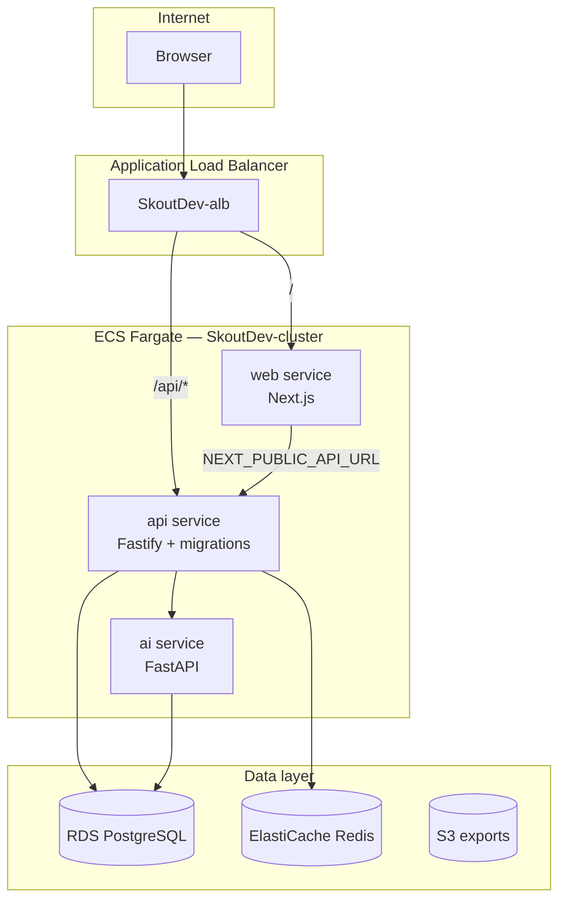

# Skout AI — Repository structure

This document explains **how** the backend and frontend repos are organized and **why** they are split and laid out this way.

---

## Two repos, one product

Skout AI uses **two Git repositories** that deploy together on AWS:

| Repo | Role | Primary stack |
|------|------|----------------|
| **Skout AI Backend** | APIs, data, workers, infrastructure, CI/CD for all services | pnpm monorepo (Node + Python + CDK) |
| **Skout Ai Frontend** | Web UI for workspace users | Next.js (single app) |

### Why separate frontend and backend?

1. **Different runtimes and release cadence** — Next.js (SSR, static assets, `NEXT_PUBLIC_*` build args) vs Fastify + Python + Postgres migrations. Frontend images rebuild on UI changes without touching API worker logic.
2. **Clear ownership** — Product/UI teams work in the frontend repo; platform/API teams work in the backend monorepo.
3. **Deployment coupling without code coupling** — GitHub Actions in the backend repo builds **both** Docker images (API, AI, Web) and deploys ECS services from one CDK app. The frontend repo stays a standard Next.js project without infra noise.
4. **Shared contracts, not shared code (yet)** — API shapes live in `@skout/shared` on the backend; the frontend mirrors types in `src/types/`. A future npm package or OpenAPI codegen can replace manual mirroring.

### How they connect locally

```
Browser (localhost:3000)
    │
    ▼
Next.js  ──HTTP──►  Fastify API (localhost:3001)
                         │
                         ├──► PostgreSQL (workspace state)
                         ├──► Redis
                         ├──► OpenSearch (prospect corpus — planned)
                         └──► AI service (localhost:8000, internal)
```

Frontend calls the API via `NEXT_PUBLIC_API_URL` and sends `X-Workspace-Id` on authenticated routes (see `src/lib/api-client.ts`).

---

## Backend monorepo (`Skout AI Backend`)

### Top-level layout

```
Skout AI Backend/
├── apps/                 # Deployable applications (each has its own Dockerfile)
│   ├── api/              # Core REST API — Fastify, port 3001
│   └── ai/               # AI orchestration — FastAPI, port 8000
├── packages/             # Shared libraries consumed by apps (not deployed alone)
│   ├── shared/           # Zod schemas, prospect_id, cross-service contracts
│   ├── db/               # Drizzle ORM schema, migrations, seed, migrate runner
│   ├── pal/              # Provider Abstraction Layer (enrichment vendors) — planned
│   └── scraper-contracts/  # Scraping job + record schemas — planned
├── workers/              # Async job processors — planned (BullMQ → Temporal)
│   └── scrapers/         # Scraping platform: bots, cleaner, ingestor (see scraping-platform-architecture.md)
├── infra/                # AWS CDK (VPC, RDS, ECS, ALB, ECR, GitHub OIDC)
├── scripts/              # Ops scripts (ECS migrations, branch protection)
├── docs/                 # Architecture, workflows, ADRs
├── .github/workflows/    # CI + deploy-dev / deploy-prod (builds backend + frontend images)
├── docker-compose.yml    # Local Postgres + Redis
└── pnpm-workspace.yaml   # Workspace root — all Node packages linked here
```

### Why a pnpm monorepo?

| Choice | Reason |
|--------|--------|
| **`apps/` vs `packages/`** | Apps are long-running services with Dockerfiles and ports. Packages are libraries versioned with the repo (`workspace:*`) and imported as `@skout/db`, `@skout/shared`. |
| **Single `pnpm-lock.yaml`** | One dependency graph; API and shared types stay on the same TypeScript/Zod versions. |
| **`infra/` as a workspace package** | CDK shares Node/tooling with the rest of the repo; `pnpm infra:deploy:dev` works from the root. |
| **Python AI app inside `apps/ai`** | Same “deployable app” rule as API, but uses `requirements.txt` instead of pnpm — keeps AI service next to the API it serves. |

### `apps/api` — Core API

```
apps/api/src/
├── index.ts              # Entry — loads env, builds app, listens
├── app.ts                # Fastify factory (plugins + routes)
├── config/env.ts         # Typed environment variables
├── plugins/
│   ├── config.ts         # Attach config to Fastify instance
│   ├── db.ts             # Attach Drizzle client (`app.db`)
│   └── workspace-context.ts  # Resolve workspace from X-Workspace-Id
├── routes/               # HTTP handlers — thin, prefix per domain
│   ├── health.routes.ts
│   ├── search.routes.ts
│   ├── prospect.routes.ts
│   ├── list.routes.ts
│   └── …
└── services/             # Business logic — called by routes
    ├── search.service.ts
    ├── prospect.service.ts
    └── …
```

**Pattern:** `routes` parse/validate HTTP; `services` implement use cases; `packages/db` owns persistence; `packages/shared` owns shared types and `prospect_id` rules.

**Why Fastify plugins?** Database and config are registered once and injected on `app` — routes stay testable and free of global singletons.

### `packages/db` — Database layer

```
packages/db/
├── src/schema/           # Drizzle table definitions (split by domain)
│   ├── workspaces.ts
│   ├── prospects.ts      # activations, lists — not the 200M OpenSearch corpus
│   ├── enrichment.ts
│   └── …
├── src/client.ts         # createDb() — used by API at runtime
├── src/migrate.ts        # CLI + ECS entrypoint migration runner
├── src/seed.ts           # Dev/demo seed data
├── drizzle/              # Generated SQL migrations
└── drizzle.config.ts
```

**Why Drizzle in a package, not inside `apps/api`?**

- Migrations run in **CI, ECS one-off tasks, and Docker entrypoint** — the migrate script must ship inside the API image but stay maintainable as its own module.
- Multiple future consumers (workers, scripts) can depend on `@skout/db` without importing the HTTP server.

**Data split (important):** PostgreSQL holds **workspace-scoped state** (activations, lists, credits, enrichment jobs). The **global prospect corpus** (~200M records) lives in **OpenSearch**, not a `prospects` table in Postgres. `prospect_id` is a logical key (SHA256), not a FK to a global row.

### `packages/shared`

Zod schemas, `prospect_id` generation, and API contracts used by the API (and mirrored on the frontend). Keeps validation rules in one place on the backend.

### `packages/pal` and `workers/` (planned)

Placeholder directories document **where** future code goes:

- **`pal`** — enrichment vendor adapters (Apollo, Hunter, etc.) behind `EnrichmentEngine.*`
- **`workers`** — BullMQ job processors in MVP; Temporal activities in v1 (send, waterfall, CRM sync, analytics ETL)

Keeping them as top-level folders avoids stuffing long-running workers into `apps/api`.

### `infra/` — AWS CDK

```
infra/
├── bin/app.ts            # CDK app entry — wires stacks per environment
├── lib/
│   ├── config/environments.ts   # dev / prod / local settings
│   ├── constructs/              # Reusable L3 pieces (ECS service, RDS, Redis)
│   └── stacks/
│       ├── network-stack.ts     # VPC, subnets, NAT
│       ├── data-stack.ts        # RDS, Redis, S3
│       ├── registry-stack.ts    # ECR + GitHub OIDC deploy role
│       └── compute-stack.ts     # ECS cluster, ALB, api / ai / web services
└── scripts/
    ├── push-dev-images.sh
    ├── force-ecs-redeploy.sh
    └── generate-local-env.ts
```

**Why CDK lives in the backend repo:** Deploy pipeline builds API + AI images from this repo and **checks out the frontend repo** in GitHub Actions to build the Web image. One `cdk deploy` updates all ECS services with a single `imageTag`.

**Stack order:** Network → Data → Registry → Compute (Compute depends on VPC, RDS endpoints, ECR repos).

### Local development vs AWS

| Concern | Local | AWS (dev/prod) |
|---------|-------|----------------|
| Postgres | `docker compose` | RDS PostgreSQL |
| Redis | `docker compose` | ElastiCache |
| API | `pnpm dev` or `docker-compose.local.yml` | ECS Fargate behind ALB |
| Migrations | `pnpm db:migrate` | Entrypoint + `scripts/ecs-run-migrations.sh` |
| Frontend | Separate repo, `npm run dev` | ECS Fargate (web service) |

---

## Frontend repo (`Skout Ai Frontend`)

### Top-level layout

```
Skout Ai Frontend/
├── src/
│   ├── app/                    # Next.js App Router — routes = folders
│   ├── components/             # React components
│   ├── lib/                    # API client, helpers
│   └── types/                  # TypeScript types (mirror backend contracts)
├── public/                     # Static assets
├── Dockerfile                  # Production image (standalone Next output)
├── docker-compose.yml          # Optional local Docker
└── .github/workflows/ci.yml    # Lint/test only — deploy lives in backend repo
```

### Why Next.js App Router?

- **File-based routing** matches product areas (`prospects/search`, `lists`, `sequences`).
- **Route groups** — `(dashboard)/` wraps authenticated pages in a shared shell (sidebar, layout) without affecting URLs.
- **Server and client components** — search and data-heavy views can mix SSR and client interactivity as features grow.

### `src/app/` — Pages map to product features

```
src/app/
├── layout.tsx                # Root layout (fonts, providers)
├── page.tsx                  # Landing / redirect
├── globals.css
└── (dashboard)/              # Route group — shared chrome, not in URL
    ├── layout.tsx            # Sidebar + workspace shell
    ├── prospects/search/     # P0 — global corpus search UI
    ├── lists/
    ├── enrichment/
    ├── sequences/
    ├── inbox/
    ├── deliverability/
    ├── ai/review/            # HITL AI draft review
    ├── analytics/
    └── settings/
        ├── workspace/
        └── crm/
```

**Why `(dashboard)`?** Next.js route groups organize layouts without adding a `/dashboard` segment. All MVP screens share one shell.

### `src/components/`

```
components/
├── ui/           # Primitive UI (button, card, input) — shadcn-style, copy-paste owned
├── workspace/    # App chrome (sidebar, nav)
└── …             # Feature components added per screen
```

**Why `ui/` vs feature folders?** Primitives are stable and design-system-like; feature components colocate with pages as the app grows.

### `src/lib/` and `src/types/`

- **`api-client.ts`** — `fetch` wrapper, `X-Workspace-Id` header, typed errors. Single place to add auth headers later.
- **`types/api.ts`** — DTO shapes aligned with `@skout/shared` / OpenAPI (manual until codegen).

**Why not import `@skout/shared` from npm today?** Frontend uses npm (not pnpm workspaces) and deploys from its own repo. Duplicating types is intentional short-term; publish `@skout/shared` or generate from OpenAPI when the API stabilizes.

### Frontend deployment

The frontend repo **does not** contain CDK or deploy workflows. On push to `develop` / `main`:

1. Backend repo’s `deploy-dev.yml` / `deploy-prod.yml` runs.
2. Workflow checks out **Skout-Ai-Frontend** (sibling repo).
3. Builds Web Docker image with `NEXT_PUBLIC_API_URL` from GitHub vars.
4. Pushes to ECR; CDK updates the `web` ECS service.

---

## End-to-end deployment shape (AWS)



| ECS service | Image built from | Port |
|-------------|------------------|------|
| `web` | Frontend repo `Dockerfile` | 3000 |
| `api` | Backend `apps/api/Dockerfile` | 3001 |
| `ai` | Backend `apps/ai/Dockerfile` | 8000 |

---

## Conventions checklist

| Topic | Convention |
|-------|------------|
| **API prefix** | `/api/v1/...` |
| **Workspace scoping** | `X-Workspace-Id` header (dev); auth session later |
| **Package names** | `@skout/<name>` |
| **Env files** | `.env.example` committed; `.env`, `.env.dev` gitignored |
| **Branches** | `develop` → dev, `uat` → sandbox, `main` → prod |
| **Commits** | Husky runs tests (`pnpm test` / `npm test`) |

---

## Related docs

- [Backend README](../README.md) — commands and MVP API list
- [infra/README.md](../infra/README.md) — CDK stacks and deploy steps
- [git-workflow.md](./git-workflow.md) — branching and releases
- [Frontend README](../../Skout%20Ai%20Frontend/README.md) — local UI setup
