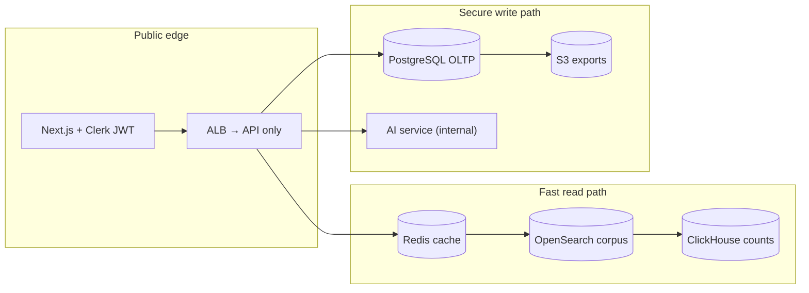
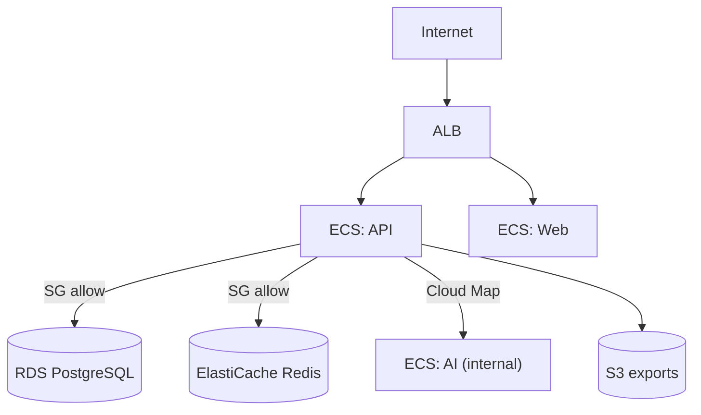
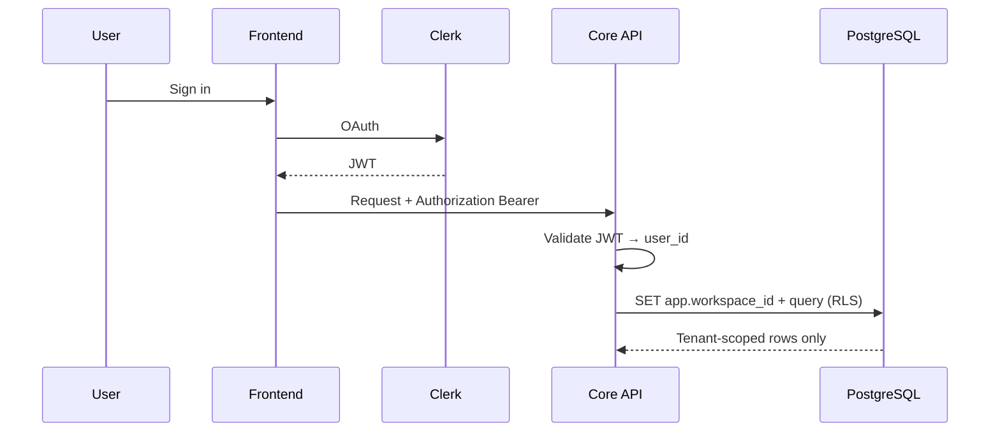

# Skout AI — Security, Compliance & Performance

How the Skout AI backend balances **data security**, **regulatory posture**, and **speed**. This document describes what is implemented today, what Sprint 1 is building, and what remains for production-grade compliance.

**Related docs**

| Document | Focus |
| --- | --- |
| [Database schema](./database-schema.md) | OLTP tables, tenant isolation, secrets conventions |
| [MVP flows](./mvp-flows.md) | User and data flows per feature |
| [ADR 0001](./adr/0001-canonical-prospect-id.md) | Deterministic `prospect_id` / `company_id` hashing |
| [Infrastructure](../infra/README.md) | AWS CDK stacks, VPC, ECS, RDS, Redis, S3 |
| [MVP development plan](./mvp/01-development-plan.md) | Sprint deliverables and build order |

---

## Core principle: separate what must be fast from what must be locked down

The platform uses three data tiers with different security and latency profiles:

| Tier | Store | Contents | Security model | Speed role |
| --- | --- | --- | --- | --- |
| **Search corpus** | OpenSearch | ~200M prospects (IDs + display fields) | Hashed identities; no raw emails in index | Sub-second discovery |
| **Workspace OLTP** | PostgreSQL | Activated records per tenant only | `workspace_id` scoping + RLS (planned) | Fast lists, CRM, credits, jobs |
| **Async processing** | Redis + BullMQ → Temporal (v1) | Enrich, export, scoring, enroll | Off hot path; workspace-scoped jobs | Heavy work without blocking API |

PostgreSQL **never** stores the full corpus. Records are materialized on activation, enrichment, or list/sequence use. See [database-schema.md](./database-schema.md).



---

## 1. Data security

### 1.1 Network and infrastructure (implemented)

Deployed environments (dev / prod) use AWS CDK stacks documented in [infra/README.md](../infra/README.md).

| Control | Implementation |
| --- | --- |
| **Private data plane** | RDS PostgreSQL and ElastiCache Redis in private subnets; `publiclyAccessible: false` |
| **Security groups** | DB and Redis ingress limited to the API ECS service security group |
| **Public surface** | ALB exposes API (and web) only; AI service is `internalOnly` via Cloud Map |
| **Secrets** | DB password and OpenAI key in AWS Secrets Manager; injected into ECS at runtime |
| **S3 exports** | SSE-S3 encryption, block all public access, `enforceSSL: true` |
| **Prod resilience** | Multi-AZ RDS, deletion protection, 14-day backup retention, S3 versioning + 90-day lifecycle |



**Code references:** `infra/lib/constructs/skout-database.ts`, `skout-redis.ts`, `skout-storage.ts`, `infra/lib/stacks/compute-stack.ts`.

### 1.2 Identity and PII minimization (implemented)

Canonical identity follows [ADR 0001](./adr/0001-canonical-prospect-id.md), implemented in `packages/shared/src/identity.ts`:

```
prospect_id  = SHA256(normalized_company_domain + ":" + SHA256(email))
company_id   = SHA256(normalized_company_domain)
```

| Rule | Rationale |
| --- | --- |
| Emails are hashed before identity derivation | Avoid storing raw emails in OpenSearch when compliance-sensitive |
| IDs are deterministic | Idempotent reindexes and billion-scale merges |
| `record_version` on activations | Optimistic concurrency for snapshot updates |

### 1.3 Application secrets (schema + infra)

| Secret type | Storage |
| --- | --- |
| Database credentials | AWS Secrets Manager → ECS task secret |
| OpenAI / LLM API keys | AWS Secrets Manager (`{stackPrefix}/openai`) |
| CRM OAuth tokens | `crm_connections.credentials_ref` → Secrets Manager (not plain text in Postgres) |
| Webhook signing secrets | `webhook_endpoints.secret_hash` (hash only, never raw) |

### 1.4 Authentication and tenancy (in progress — Sprint 1)

| Control | Current state | Target (Sprint 1) |
| --- | --- | --- |
| API authentication | `X-Workspace-Id` header with hardcoded fallback | Clerk JWT validated on every protected route |
| User → workspace mapping | Stub `WorkspaceService` | `users` + `workspace_members` with roles (`owner`, `admin`, `member`) |
| Row-level security | Planned in Drizzle schema | Enable RLS on tenant tables after auth wiring |
| Rate limiting | Not implemented | Per-workspace limits aligned with credit guard |

**Code references:** `apps/api/src/plugins/workspace-context.ts`, `packages/db/src/schema/`.



### 1.5 AI service isolation

The FastAPI AI service (`apps/ai`, port 8000) is not exposed on the public ALB. Only the Core API can reach it over the private network (ECS service connect / Cloud Map). LLM API keys never reach the browser or frontend.

---

## 2. Regulatory and compliance posture

Skout is a B2B sales-intelligence product. Primary regulatory surfaces include **GDPR** (EU contacts), **CCPA** (California residents), and **email / marketing rules** (CAN-SPAM, PECR, etc.). The architecture supports compliance by design; operational policies and customer-facing documentation are still required.

### 2.1 Built into the data model

| Principle | How the backend supports it |
| --- | --- |
| **Data minimization** | Full corpus in OpenSearch; only activated prospects in PostgreSQL per workspace |
| **Pseudonymization** | Hashed `prospect_id` / `company_id`; email hashed before identity derivation |
| **Tenant isolation** | `workspace_id` on all tenant tables; RLS planned |
| **Retention limits** | S3 export lifecycle: 7d (local) → 30d (dev) → 90d (prod) |
| **Auditability** | Append-only `credit_transactions`; `async_jobs` with status and timestamps |
| **Credit guardrails** | Hard block on paid actions at zero balance; read-only access to saved lists |

### 2.2 Data processing and third parties

| Integration | Data shared | Control |
| --- | --- | --- |
| Enrichment (Apollo, Hunter, etc.) | Company domain, name for email lookup | PAL adapters; platform keys at MVP (BYOK deferred) |
| LLM scoring (OpenAI via LiteLLM) | ICP config + prospect snapshot fields | Internal AI service only; no client-side keys |
| HubSpot export | Enriched contact fields | OAuth via `crm_connections`; private app at MVP |
| Webhooks | Workspace events to customer URL | HMAC signing with stored `secret_hash` |

Customers and vendors will need **Data Processing Agreements (DPAs)** before enterprise sales.

### 2.3 Required before production compliance (not yet implemented)

| Item | Description |
| --- | --- |
| **Lawful basis documentation** | B2B legitimate interest vs consent per jurisdiction |
| **DSR endpoints** | Export and delete workspace-held data on subject request |
| **Suppression lists** | Honor unsubscribe / do-not-contact across enrich, sequences, and export |
| **Regional data residency** | Pin OpenSearch / RDS to EU region if required by customers |
| **Privacy policy & subprocessors list** | Customer-facing disclosure of data flows |
| **SOC 2 / penetration testing** | Typical for enterprise procurement (post-MVP) |

MVP explicitly defers enterprise permissions, multi-tenant admin, and dedup engine. Acceptable for beta; not sufficient for enterprise compliance sales without the items above.

---

## 3. Performance and speed

Speed comes from **never doing slow work on the hot path** and **caching aggressively**.

### 3.1 Search path (highest traffic)

Planned flow (see [mvp-flows.md § Prospect Search](./mvp-flows.md#2-prospect-search)):

```
POST /search/prospects
  → Redis cache lookup (key = hash of filters + page; TTL 5 min)
  → on miss: OpenSearch (prospect IDs + display fields)
  → optional: ClickHouse (total counts / facets)
  → write-through to Redis
  → response includes cached: true | false
```

| Layer | Purpose | MVP status |
| --- | --- | --- |
| Redis | Search result cache | Docker Compose ready; code not wired |
| OpenSearch | Corpus search | Returns synthetic demo data (stub) |
| ClickHouse | Aggregations | Optional wire-up in staging |

**Sprint 1 target:** 500K+ real records indexed; `cached: true` when served from Redis.

### 3.2 Async-by-default for slow operations

Heavy endpoints return **202 Accepted** and queue work via BullMQ (MVP) → Temporal (v1):

| Endpoint | Work offloaded |
| --- | --- |
| `POST /prospects/:id/enrich` | PAL waterfall (Apollo → Hunter → …) |
| `POST /sequences/:id/enroll` | Sequence step scheduling |
| CSV / HubSpot export | Bulk contact push |
| AI scoring | LLM inference via internal AI service |

This keeps API p99 latency low and lets workers scale independently.

### 3.3 Infrastructure scaling path

| Stage | Stack | Speed lever |
| --- | --- | --- |
| **MVP** | Redis + BullMQ + OpenSearch (Bonsai or AWS) | Cache + async workers |
| **Staging** | ClickHouse for search analytics | Offload count queries from OpenSearch |
| **v1** | Temporal + Kafka | Durable workflows, event replay at scale |
| **Prod** | Multi-AZ RDS, 2× ECS tasks, larger Redis | HA + horizontal API scale |

Prod sizing (from `infra/lib/config/environments.ts`): `t4g.small` RDS multi-AZ, `cache.t4g.small` Redis, 2 desired tasks per API/AI/web service.

### 3.4 Cost and abuse controls

Per-workspace **credits** act as both monetization and rate limiting:

- Search on saved lists: allowed when credits are zero (read-only)
- Enrich, export, scoring: hard block at zero balance
- Aligns with per-workspace rate limiting (planned, decision D33)

---

## 4. How security, compliance, and speed work together

| Security | Compliance | Speed |
| --- | --- | --- |
| VPC + security groups | Minimize OLTP data | OpenSearch for corpus search |
| Secrets Manager | Hash PII in search index | Redis cache (5 min TTL) |
| JWT + RLS | Workspace isolation | 202 + BullMQ for enrich/export |
| Internal AI service | No raw emails in OpenSearch | ClickHouse for counts only |
| S3 encryption + lifecycle | Export retention limits | Activate-on-demand to PostgreSQL |

None of these trade-offs are zero-sum: the tiered architecture exists so search stays fast without weakening tenant boundaries or retention policy.

---

## 5. Implementation status

| Area | Status | Next step |
| --- | --- | --- |
| AWS network isolation | ✅ Deployed (dev/prod CDK) | UAT stack when ready |
| S3 / RDS encryption & backups | ✅ Configured per environment | Verify restore procedure (decision D31) |
| Deterministic identity hashing | ✅ `@skout/shared` | Enforce on all ingest paths |
| Clerk JWT auth | ❌ Not wired | Sprint 1 — API middleware + frontend |
| PostgreSQL RLS | ❌ Commented out | Enable after auth maps `user_id → workspace_id` |
| Redis search cache | ❌ Not wired | Sprint 1 — cache key = hash(filters) |
| OpenSearch live index | ❌ Stub data | Sprint 1 — 500K record bulk import |
| Per-workspace rate limits | ❌ Not implemented | Sprint 1 / hardening |
| DSR / suppression APIs | ❌ Not planned for MVP | Post-beta compliance sprint |
| SOC 2 / pen test | ❌ Deferred | Enterprise readiness |

---

## 6. Sprint 1 checklist (security + speed)

Ordered by dependency:

1. **Clerk auth** — JWT validation on API; `user_id` → `workspace_id` via `workspace_members`
2. **Enable RLS** — `prospect_activations`, `lists`, `async_jobs`, and other tenant tables
3. **OpenSearch** — index mapping aligned with `prospectSummarySchema`; bulk import script
4. **Redis cache** — wrap `SearchService.searchProspects`; set `cached` flag in response
5. **Credit guard middleware** — block paid actions; allow read-only list/search
6. **Per-workspace rate limiting** — Redis token bucket or equivalent
7. **Secrets audit** — confirm no API keys in env files committed to repo; CRM tokens use `credentials_ref`

---

## 7. Environment-specific settings

| Setting | Local | Dev | Prod |
| --- | --- | --- | --- |
| RDS multi-AZ | No | No | Yes |
| Backup retention | 0 days | 3 days | 14 days |
| S3 export retention | 7 days | 30 days | 90 days |
| S3 versioning | Off | On | On |
| ECS desired count (API) | 1 | 1 | 2 |
| Deletion protection (RDS) | Off | Off | On |

Full config: `infra/lib/config/environments.ts`.

---

## 8. References

| Resource | Path |
| --- | --- |
| Identity helpers | `packages/shared/src/identity.ts` |
| Workspace context (MVP) | `apps/api/src/plugins/workspace-context.ts` |
| Search service (cache stub) | `apps/api/src/services/search.service.ts` |
| Drizzle ORM + migrations | `packages/db/` |
| Schema definitions (per story) | `packages/db/src/schema/` |
| CDK data stack | `infra/lib/stacks/data-stack.ts` |
| CDK compute stack | `infra/lib/stacks/compute-stack.ts` |
