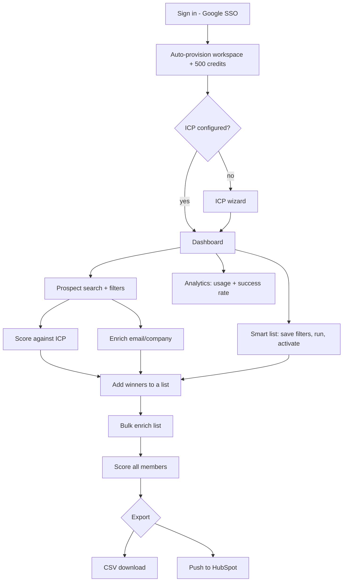

# Skout AI — Complete Feature & Architecture Guide

> A single reference covering every MVP feature, how it works on the backend, how
> settings (ICP, BYOK, CRM, credits) ripple across the product, and the forward roadmap.
>
> Audience: product, sales/demo, and engineering onboarding.
> Last updated: 2026-06-28

---

## Table of contents

1. [What Skout AI is](#1-what-skout-ai-is)
2. [Data architecture (the two-tier model)](#2-data-architecture-the-two-tier-model)
3. [Feature catalog (detailed working)](#3-feature-catalog-detailed-working)
4. [How settings affect other features](#4-how-settings-affect-other-features)
5. [Credit economics](#5-credit-economics)
6. [End-to-end user journey](#6-end-to-end-user-journey)
7. [Future plan / roadmap](#7-future-plan--roadmap)
8. [Appendix: data store map](#8-appendix-data-store-map)

---

## 1. What Skout AI is

Skout AI is a **GTM (go-to-market) operating system**: find prospects, qualify them
with AI against your Ideal Customer Profile, enrich contact data on demand, organize
into lists, and push to your CRM.

The core insight: **company data is a commodity; the value is the intelligence layer.**
So Skout builds a cheap, broad prospect corpus itself and only spends money on paid
APIs when a user shows intent (enrich) or a lead scores high (phone lookup).

### Tech stack

| Layer | Technology |
|-------|------------|
| Frontend | Next.js 14, React Query, Clerk, Tailwind |
| API | Fastify (Node), Drizzle ORM |
| AI service | Python FastAPI, LiteLLM → OpenAI |
| Search | OpenSearch |
| Database | PostgreSQL |
| Cache / queues | Redis + BullMQ |
| Object storage | S3 (scraper artifacts) |
| Auth | Clerk (Google SSO) |
| CRM | HubSpot OAuth |
| Billing | Razorpay |

---

## 2. Data architecture (the two-tier model)

Everything in Skout flows through two tiers. Understanding this explains every feature.

```
TIER 1 — CORPUS (global, cheap)              TIER 2 — WORKSPACE (per-tenant, paid)
┌─────────────────────────────┐             ┌──────────────────────────────────┐
│ OpenSearch prospects index  │  activate   │ PostgreSQL                        │
│  • scraped records          │ ─────────▶  │  • prospect_activations (snapshot)│
│  • manual entries           │             │  • lists / list_members           │
│  • global, all workspaces   │             │  • enrichment_jobs / results      │
│  • powers SEARCH            │             │  • prospect_scores                │
└─────────────────────────────┘             │  • credits / icp / crm / byok     │
                                             └──────────────────────────────────┘
```

| Concept | Meaning |
|---------|---------|
| **Corpus** | Global pool of prospects in OpenSearch. Read-only via search. No workspace owns it. |
| **Activation** | The moment a prospect is copied into a workspace (`prospect_activations`). Free. Creates a JSON `snapshot` the workspace owns and can enrich. |
| **Enrichment** | On-demand paid API calls (PAL waterfall) that fill in email/phone/firmographics on an activated prospect. |
| **Scoring** | AI qualification of a prospect against the workspace ICP (0–100). |

> Rule of thumb: **search reads the corpus; everything you "own" lives in Postgres
> as an activation.**

---

## 3. Feature catalog (detailed working)

Each feature below lists: the user action, the backend flow, key field meanings, and
where results are saved.

### 3.1 Authentication & workspace provisioning

**User action:** Sign in with Google.

**Backend flow:**
1. Clerk issues a JWT; the Fastify auth plugin verifies it on every request.
2. `resolveOrProvisionUser()` resolves the user by `clerk_user_id` (fast path) or
   email (back-fill for legacy accounts).
3. First-ever login provisions a bundle in one transaction:
   - `workspaces` row
   - `workspace_members` row with role `owner`
   - `credit_balances` seeded with **500 starter credits**
   - `credit_transactions` row (action `provision`)

**Field meanings:**

| Field | Meaning |
|-------|---------|
| `clerk_user_id` | SSO identity from Clerk |
| `workspace_id` | Tenant boundary — every other table is scoped by it |
| `role` | `owner` / `admin` / `member`; gates admin features (scraper) |

**Saved in:** Postgres — `users`, `workspaces`, `workspace_members`, `credit_balances`, `credit_transactions`.

**Endpoint:** `GET /api/v1/me`

---

### 3.2 ICP (Ideal Customer Profile)

**User action:** Complete the onboarding wizard or edit ICP settings.

**Backend flow:** `PUT /workspace/icp` validates and upserts the config JSON, bumping a `version`.

**Config fields:**

| Field | Type | What it drives |
|-------|------|----------------|
| `industries[]` | string[] | Industry match in scoring |
| `countries[]` | string[] | Geo match in scoring |
| `seniorities[]` | string[] | Seniority match (Executive/Manager) |
| `titles[]` | string[] | Title keyword match (LLM scoring) |
| `keywords[]` | string[] | Company keyword match |
| `minEmployees` / `maxEmployees` | number | Company size fit |

**Saved in:** Postgres — `workspace_icp` (`config` JSONB, `version`).

> **ICP is the single most cross-cutting setting in the product.** See
> [section 4](#4-how-settings-affect-other-features).

---

### 3.3 Prospect search

**User action:** Type a query, apply filters, page through results.

**Backend flow:**
1. `POST /search/prospects` builds a cache key (SHA-256 of workspace + query + filters).
2. **Cache hit (Redis):** returns instantly, `creditsUsed = 0`.
3. **Cache miss:** deduct 1 credit → query OpenSearch (or in-memory demo corpus) → cache result.

**Filter groups (40+):** person (title, seniority, department, availability flags),
company (name, domain, industry, size, stage), geo (country/state/city), signals
(intent score, hiring, tech stack), and dedupe (`excludeDuplicates`, `maxPerCompany`).

**Response fields:**

| Field | Meaning |
|-------|---------|
| `results[]` | Page of prospect summaries |
| `total` | Match count after dedupe |
| `cached` | `true` = served free from Redis |
| `creditsUsed` | 0 (cached) or 1 (live) |

**Saved in:** nothing persisted except the credit deduction (`credit_transactions`)
and the Redis cache entry. Search is read-only over the corpus.

---

### 3.4 Manual prospect entry

**User action:** Fill the "Add prospect" form (only full name required).

**Backend flow:** `POST /prospects/manual` normalizes the domain, generates deterministic
`company_id` / `prospect_id`, and upserts the document **directly into OpenSearch**.

**Saved in:** OpenSearch only. It becomes searchable; it is not owned by the workspace
until added to a list (which activates it).

---

### 3.5 Activation

**User action:** Add search results to a list, click "activate", or activate a smart list.

**Backend flow:** `EnrichmentService.activate()` upserts a `prospect_activations` row per
prospect. **No external API spend.** The `snapshot` JSON holds identity fields and is
later merged with enrichment output.

**Saved in:** Postgres — `prospect_activations` (`snapshot` JSONB, unique per workspace+prospect).

---

### 3.6 Contact enrichment (PAL waterfall) — flagship

**User action:** Click "Enrich" on a prospect, choose which fields to enrich
(company, email, validation, phone).

**Backend flow (`enrichProspect`):**
1. Ensure activation exists.
2. Credit pre-check (balance ≥ 1).
3. Create `enrichment_jobs` row → `queued`, then `running` (distinct `startedAt`).
4. Resolve lead score (needed for the phone gate).
5. Build a per-workspace PAL engine (BYOK keys + platform keys).
6. Run the waterfall.
7. Deduct credits by successful step.
8. Merge primary results back into the activation snapshot.
9. Persist results + attempts, mark job `completed`.

**The waterfall (in order):**

```
Step 0  internal_graph   FREE   reuse cached company/email from the activation snapshot
Step 1  firmographics    PAID   PDL → RevenueBase → Explorium → Coresignal (workspace key first)
Step 2  email find       PAID   Hunter; else pattern-gen (firstname.lastname@domain, conf 0.4)
Step 3  email validation PAID   MillionVerifier → ZeroBounce → NeverBounce
                                 email becomes "primary" ONLY if status === valid
Step 4  phone            PAID   GATED: lead score must be > 80
                                 Datagma → Kaspr → Lusha → ContactOut → Cognism
```

**Field result meanings (`FieldResult`):**

| Field | Meaning |
|-------|---------|
| `field` | `company`, `email`, `email_status`, `phone` |
| `value` | String value (the email, the status) |
| `valueJson` | Structured payload (CompanyData / EmailVerification / PhoneData) |
| `provider` | Vendor that produced it, or `internal_graph` / `pattern-gen` / `phone-gate` |
| `confidence` | 0–1 (email finders) |
| `validationStatus` | `valid` / `invalid` / `catch_all` / `risky` / `unknown` / `skipped` / `error` |
| `isPrimary` | `true` = canonical value stored on the activation |
| `billingSource` | `workspace` (BYOK, 25% cheaper) or `platform` |

**Attempt log meanings (`AttemptLog`):** every provider call records `order`, `provider`,
`operation` (`fetchCompany`/`findEmail`/`verify`/`fetchPhone`/`score-gate`), `status`
(`ok`/`miss`/`error`/`skipped`), `latencyMs`, and a `detail` (error or skip reason).
This is what powers the per-step timeline in the job detail sheet.

**Credit billing:** each successful paid step adds billing quarters (workspace key = 3,
platform key = 4); total credits = `ceil(quarters / 4)`. Free steps (internal graph,
pattern-gen, gate skips) cost nothing.

**Job status lifecycle:** `queued → running → completed | failed`, with `queuedAt`,
`startedAt`, `completedAt` timestamps.

**Saved in (Postgres):**

| Table | Contents |
|-------|----------|
| `enrichment_jobs` | status, timestamps, creditsUsed, fieldsRequested, trigger |
| `enrichment_results` | one row per field result |
| `enrichment_attempts` | one row per provider attempt |
| `prospect_activations.snapshot` | merged primary email/phone/company |
| `credit_transactions` | deduction (action `enrichment`) |

**Bulk enrich:** `POST /lists/:id/enrich` creates an `enrichment_batches` row and
enriches each member with `trigger=bulk`; the UI polls `GET /enrichment/batches/:id`.

---

### 3.7 AI lead scoring

**User action:** Click "Score" on a prospect, or "Score all" on a list.

**Backend flow (`score`):**
1. Load workspace ICP; reject with `ICP_NOT_CONFIGURED` if empty.
2. Deduct 2 credits.
3. Call `scoreProspect()` → Python `POST /v1/score` (LLM) or local heuristic fallback.
4. Persist to `prospect_scores`.

**Score output (`ScoreResult`):**

| Field | Meaning |
|-------|---------|
| `icpScore` | 0–100 fit against ICP |
| `icpBand` | `strong` (≥75) / `medium` (≥45) / `weak` (<45) |
| `intentScore` | 0–100 from buying-signal count |
| `outreachReadiness` | `ready` / `warm` / `nurture` / `not_qualified` |
| `painPoints[]` | LLM-detected pains (LLM path only) |
| `reasoning` | Human-readable explanation |
| `source` | `llm` or `heuristic` |

**Heuristic fallback math:** base 40; industry +20/−10, seniority +15, geo +10/−5,
size-in-range +10; intent = 25 × signal count.

**Saved in:** Postgres — `prospect_scores` (+ `credit_transactions` action `ai_score`).

**Batch:** `POST /lists/:id/score` runs via BullMQ `list-score` worker (sync fallback if
no Redis); progress polled at `GET /enrichment/score-jobs/:jobId`.

---

### 3.8 Lists

**User action:** Create lists, add/remove members, bulk enrich, view detail.

**Backend flow:** CRUD on `lists`; members in `list_members`; `getListDetail()` joins each
member's activation snapshot with its score.

**Saved in:** Postgres — `lists`, `list_members` (joins `prospect_activations`, `prospect_scores`).

---

### 3.9 Smart lists

**User action:** Save a set of filters; run to preview; activate to materialize.

**Backend flow:**
- `POST /smart-lists` saves `{ name, filters }`.
- `run` executes filters live against OpenSearch (read-only preview).
- `activate` runs filters → activates every match → creates/extends a static list.

**Saved in:** Postgres — `smart_lists` (filter JSON). Activation writes
`prospect_activations` + `lists` + `list_members`.

---

### 3.10 HubSpot CRM sync

**User action:** Connect HubSpot, import contacts, export a list.

**Backend flow:**
- **Connect:** OAuth with signed state → tokens stored encrypted in `crm_connections`.
- **Import:** pull contacts (all or a HubSpot list, max 500) → activate → add to a Skout list; record `crm_prospect_mappings`.
- **Export:** deduct 1 credit/contact → BullMQ `crm-export` worker pushes to HubSpot Contacts API; idempotent via mappings.

**Saved in:** Postgres — `crm_connections`, `crm_prospect_mappings`, `async_jobs`.

---

### 3.11 BYOK integrations

**User action:** Paste your own enrichment-provider API key; test it.

**Backend flow:** `PUT /integrations/:provider` encrypts the key (AES-256-GCM) into
`workspace_integrations`. On enrich, `createRegistryWithByok()` puts your adapters
**before** platform adapters.

**Effect:** your keys are used first, and those steps bill at **75% of the platform rate**.

**Saved in:** Postgres — `workspace_integrations` (encrypted).

---

### 3.12 Credits & billing

**Credit ledger (`credit_transactions`):** every spend/add is a row. Balance lives in
`credit_balances.balance`.

| action | Trigger | Delta |
|--------|---------|-------|
| `provision` | First login | +500 |
| `search` | Live search | −1 |
| `ai_score` | Score | −2 |
| `enrichment` | PAL waterfall | −N by steps |
| `export_hubspot` | CRM export | −1 / contact |
| `admin_topup` | Beta top-up | +100 |
| `razorpay_purchase` | Paid pack | +pack |

**Razorpay:** `POST /billing/razorpay/order` creates an order; the webhook verifies the
HMAC signature and credits the workspace on `payment.captured`.

**Saved in:** Postgres — `credit_balances`, `credit_transactions`, `payment_orders`.

---

### 3.13 AI personalization

**User action:** Generate an outreach draft for a prospect.

**Backend flow:** `POST /enrichment/personalize` → Python `/v1/personalize` (or heuristic)
→ saves opener + talking points to `ai_drafts`.

**Saved in:** Postgres — `ai_drafts`. (Note: the `GET /ai/drafts` list endpoint is still a stub.)

---

### 3.14 Corpus scrape pipeline (admin)

**User action (owner/admin):** Queue a scrape job with a source + seeds.

**Backend flow:** `POST /scrape/jobs` writes `scrape_jobs` and enqueues BullMQ
`scrape-schedule`. Orchestrator → bot (scrape → raw S3) → cleaner (normalize → clean S3)
→ ingestor (bulk upsert → OpenSearch).

**Count fields:** `rawCount`, `cleanCount`, `quarantinedCount`, `ingestedCount`, `skippedDuplicateCount`.

**Saved in:** Postgres `scrape_jobs`; S3 artifacts; OpenSearch documents.

---

### 3.15 Dashboard & analytics

- `GET /dashboard/summary` — credits, list count, prospects in lists, ICP flag, weekly
  search/enrich/export counts, last 5 jobs.
- `GET /analytics/report?days=N` — daily credit usage, enrichment success rate, credits
  by action, recent transactions.

Both aggregate from `credit_transactions`, `enrichment_jobs`, `lists`, `workspace_icp`.

---

## 4. How settings affect other features

This is the most important section for understanding the product as a system. Settings
are not isolated — they cascade.

### 4.1 ICP — the master switch

ICP is read by almost every "intelligence" feature. If ICP is empty, those features are
blocked or degraded.

```
                    ┌──────────────────────────┐
                    │      Workspace ICP        │
                    │ industries, geo, titles,  │
                    │ seniority, size range     │
                    └────────────┬─────────────┘
                                 │ read by
       ┌──────────────┬──────────┼───────────────┬──────────────┐
       ▼              ▼          ▼                ▼              ▼
   Single score   List "Score   Smart-list     Enrichment     Dashboard
   (search row)   all" (batch)  score (corpus) PHONE GATE      "ICP set?" flag
```

| Feature | Effect when ICP is set | Effect when ICP is empty |
|---------|------------------------|--------------------------|
| Score a prospect | Returns icpScore/band/readiness | `400 ICP_NOT_CONFIGURED` |
| List "Score all" | Batch scores members | Blocked (same error) |
| Smart-list score | Scores corpus matches | Blocked |
| **Enrichment phone step** | Lead score computed from ICP gates phone (>80) | Score computed but low → phone usually skipped |
| Enrichment (email/company) | Works; also computes a score for the gate | Works; UI redirects to ICP setup first |
| Dashboard | `icpConfigured = true` | Warning banner + setup prompt |

**Key cascade:** Enrichment internally **scores the prospect** to evaluate the phone
gate, and re-scores after firmographics arrive (industry/size may change the score). So
**editing your ICP changes which prospects qualify for phone enrichment** and how every
future score lands.

> Changing ICP does **not** retroactively re-score existing prospects — scores are stored
> in `prospect_scores` from when they were last scored. Re-run "Score all" to refresh.

### 4.2 BYOK integration keys

| You set | Effect on enrichment |
|---------|---------------------|
| A workspace key (e.g. Hunter) | That provider is tried **before** the platform's, and the step bills at **75%** |
| No workspace key | Platform key used (full rate), or a stub if no platform key either |

So adding BYOK keys changes **provider order, success rate, and credit cost** of every
future enrichment — but not past jobs.

### 4.3 CRM (HubSpot) connection

| State | Effect |
|-------|--------|
| Connected | List detail shows "Export to HubSpot"; import is available |
| Not connected | Export button warns; import disabled |

Importing contacts **activates** them (creating `prospect_activations`), so imported
contacts immediately behave like any other workspace prospect (scorable, enrichable).

### 4.4 Credits balance

Credits gate **every paid action**. When balance is insufficient the API returns
`402 insufficient_credits` and the frontend shows the global top-up modal.

| Action blocked at low balance | Cost |
|-------------------------------|------|
| Live search | 1 |
| Score | 2 |
| Enrichment | variable |
| HubSpot export | 1/contact |

Batch operations (list score / list enrich) **pre-check total cost** and fail fast before
spending if the balance can't cover the whole batch.

### 4.5 Workspace role

| Role | Extra access |
|------|--------------|
| `owner` / `admin` | Corpus scrape pipeline (`/scrape/jobs`) |
| `member` | Everything except scrape admin |

### 4.6 Environment-level toggles (ops, not user-facing)

| Setting | Effect |
|---------|--------|
| `OPENSEARCH_URL` unset | Search & smart lists fall back to in-memory demo corpus |
| `REDIS_URL` unset | Search cache in-memory; list scoring runs sync; scrape/export queues fail gracefully |
| `AI_SERVICE_URL` / `OPENAI_API_KEY` unset | Scoring & personalization use heuristic fallback |
| `ENRICHMENT_PHONE_SCORE_GATE` (default 80) | Threshold a lead score must exceed for phone lookup |
| provider API keys | Each present key flips that capability from stub → live |

---

## 5. Credit economics

```
Free:    activation, internal-graph cache hits, pattern-gen email guess,
         cached search, phone-gate skips
Paid:    search (1), score (2), each successful enrichment step (~1),
         HubSpot export (1/contact)
Cheaper: BYOK steps bill at 75% of platform rate
```

The model is deliberately **"build cheap, spend on intent"**: the corpus is free to
search broadly; money is only spent when the user activates and enriches a specific
prospect, and phone (the most expensive data) is locked behind a high lead score.

---

## 6. End-to-end user journey



---

## 7. Future plan / roadmap

Status legend: ✅ done · 🟡 partial · 🔴 planned

### 7.1 Outreach engine (next major area — currently scaffolded)

These routes exist with "Coming soon" placeholders and are the clearest next milestone.

| Feature | Today | Plan |
|---------|-------|------|
| **Sequences** | 🔴 Stub (`/sequences`) | Multi-step email/LinkedIn cadences with delays and branching; Temporal-backed scheduling referenced in code. |
| **Unified inbox** | 🔴 Stub (`/inbox/threads`) | Reply tracking, thread view, conversation state across sequences. |
| **Deliverability** | 🔴 Stub (`/inboxes`, `/domains`) | Sending-domain warmup, inbox rotation, bounce/spam monitoring. |
| **AI review queue** | 🔴 Stub (`/ai/drafts` list) | Human-in-the-loop approval of AI-generated outreach drafts (drafts already persist via personalize; only the list endpoint is missing). |

### 7.2 AI layer deepening

| Item | Today | Plan |
|------|-------|------|
| ICP scoring | 🟡 Heuristic + optional LLM | Full LLM scoring as default with explainable reasoning. |
| Intent classification | 🟢 Live (`/v1/classify` LLM + heuristic, HITL on low confidence) | Typed buy/respond/need (+ reply labels); feeds intent_score. |
| Pain-point detection | 🟡 LLM in personalize | First-class pain-point surfacing on prospect detail. |
| Auto re-scoring | 🔴 | Re-score stored prospects automatically when ICP changes. |

### 7.3 Corpus pipeline maturation (Tier 1)

| Item | Today | Plan |
|------|-------|------|
| Scraper bots | 🟡 Node bots + BullMQ; Python `company-web` scaffold | Broaden source coverage (LinkedIn, Crunchbase, job boards, Google Business). |
| Cleaner enrichment | 🟡 Normalize + technographics + basic signals | AI industry classification, headcount-growth and funding signals. |
| Scraper ECS | 🔴 ECR repos exist; services not deployed | Deploy orchestrator/cleaner/ingestor as ECS services. |

### 7.4 Analytics & data platform

| Item | Today | Plan |
|------|-------|------|
| Analytics | 🟡 Postgres aggregates | Move heavy analytics to ClickHouse (referenced in architecture, not wired). |
| Webhooks | 🔴 Stub (`/webhooks`) | Outbound event webhooks for integrations. |

### 7.5 Platform / infrastructure

| Item | Today | Plan |
|------|-------|------|
| HTTPS edge | 🟡 API Gateway in front of ALB (HTTP blocked) | Move to CloudFront once the AWS account is verified for it. |
| Billing | 🟡 Razorpay (INR) | Add Stripe for global/USD (referenced as future in code/docs). |
| Multi-seat | 🟡 Roles exist (owner/admin/member) | Full team management UI, invites, per-seat permissions. |

### 7.6 Suggested sequencing

1. **AI review queue** — smallest gap (drafts already persist); unlocks the outreach story.
2. **Sequences + deliverability** — the biggest value-add and the natural next product surface.
3. **LLM scoring by default + auto re-score** — strengthens the core differentiator.
4. **Scraper ECS deploy + source coverage** — grows the corpus moat.
5. **ClickHouse analytics + Stripe + CloudFront** — scale/ops hardening.

---

## 8. Appendix: data store map

| Feature | PostgreSQL | OpenSearch | Redis | S3 |
|---------|-----------|------------|-------|-----|
| Auth / provisioning | users, workspaces, members, credits | — | — | — |
| ICP | workspace_icp | — | — | — |
| Search | credit txn only | corpus (read) | result cache | — |
| Manual prospect | — | upsert | — | — |
| Activation | prospect_activations | — | — | — |
| Enrichment | jobs, results, attempts | — | (bulk via queue) | — |
| Scoring | prospect_scores | optional sync | list-score queue | — |
| Lists | lists, list_members | — | — | — |
| Smart lists | smart_lists | query on run | — | — |
| HubSpot | crm_connections, crm_prospect_mappings, async_jobs | — | crm-export queue | — |
| BYOK | workspace_integrations (encrypted) | — | — | — |
| Credits / billing | credit_balances, credit_transactions, payment_orders | — | — | — |
| AI draft | ai_drafts | — | — | — |
| Scrape | scrape_jobs | ingest | scrape queues | raw/clean/quarantine |

---

*Generated as a living reference. Update alongside `data-enrichment-implementation-status.md`
as features ship.*
